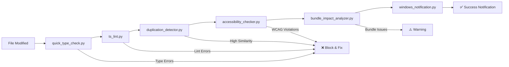

# Claude Code Hooks Directory

This directory contains all PostToolUse and PreToolUse hooks for the Maguru e-learning platform.

## 📁 Directory Structure

```
.claude/hooks/
├── README.md                       # This documentation
├── cache/                          # All log files and cache data
│   ├── accessibility_checker_log.json
│   ├── duplication_detector_log.json
│   ├── quick_type_check_log.json
│   ├── duplication_cache.json
│   └── type_check_cache.json
├── shared/                         # Shared utilities
│   └── hook_utils.py              # Common functions for all hooks
├── utils/                          # Additional utilities
│   └── generate_audio_clips.py
│
├── PostToolUse Hooks (Quality Gates):
├── quick_type_check.py            # TypeScript validation (CRITICAL)
├── accessibility_checker.py       # WCAG compliance (CRITICAL)
├── duplication_detector.py        # Code duplication analysis (IMPORTANT)
├── bundle_impact_analyzer.py      # Bundle size monitoring (RECOMMENDED)
├── ts_lint.py                     # ESLint validation (existing)
│
├── PreToolUse Hooks (Prevention):
├── function_registry_checker.py   # Function duplication prevention
├── pre_edit_validation.py         # File safety validation
├── validate_environment.py        # Environment checks
├── use_bun.py                     # Package manager enforcement
│
├── PreCompact Hooks (Session Backup):
├── pre_compact_session_backup.py  # Context backup before compaction
│
└── Utility Hooks:
├── windows_notification.py        # User notifications
├── play_audio.py                  # Audio feedback
├── log_pre_tool_use.py           # Command logging
├── cleanup_and_report.py          # Session cleanup
└── check_input.py                # Input validation
```

---

## 🛡️ PreToolUse Prevention Hooks

PreToolUse hooks run **before** Claude Code executes tool operations, providing validation, enforcement, and safety checks to prevent issues before they occur.

### 📦 use_bun.py - Package Manager Enforcement

**Purpose**: Enforce yarn usage across the project, block npm/pnpm commands with suggested alternatives

**Triggers**:

- **Matcher**: `"Bash"`
- **Commands**: All bash commands containing npm/pnpm patterns
- **Patterns Detected**: `npm install`, `npm run`, `pnpm install`, `pnpm run`, etc.

**Performance**: <100ms validation, blocking execution on policy violations

**Exit Codes**:

- `0` (success): Command approved (yarn/npx usage)
- `2` (block): Command blocked with yarn alternative suggested

**Troubleshooting**:

- **Error**: "Project ini menggunakan 'yarn' sebagai package manager utama"
- **Solution**: Use suggested yarn command or justify npm usage if specific requirement

### 🌍 validate_environment.py - Environment Validation

**Purpose**: Validate Node.js version, Yarn availability, and critical environment variables before development commands

**Triggers**:

- **Matcher**: `"Bash"`
- **Commands**: Development commands (yarn install/add/remove, yarn dev/build/start, prisma, next dev/build)
- **Skip**: Safe read-only commands for performance

**Performance**: 5-10s comprehensive validation, smart pattern detection

**Exit Codes**:

- `0` (success): All environment checks passed
- `2` (block): Critical environment issues detected

**Troubleshooting**:

- **Node.js Issues**: Install Node.js 18+ from https://nodejs.org/
- **Yarn Issues**: Run `npm install -g yarn`
- **Environment Issues**: Copy `.env.example` to `.env.local` and configure

### 🔍 function_registry_checker.py - Function Duplication Prevention

**Purpose**: Prevent function duplication across features using README.md as living documentation registry

**Triggers**:

- **Matcher**: `"Write|Edit|MultiEdit"`
- **Files**: Code files (.ts, .tsx, .js, .jsx, .py)
- **Analysis**: Extracts functions from new code and compares with README.md registry

**Performance**: 1-3s semantic analysis using AST parsing and similarity algorithms

**Exit Codes**:

- `0` (success): No duplications detected or warnings only
- `2` (block): High similarity functions detected (>95% similarity)

**Troubleshooting**:

- **False Positives**: Use more specific function names or update README.md registry
- **Missing Registry**: Create README.md in feature folder with function documentation

### 🔒 pre_edit_validation.py - File Safety & Architecture Validation

**Purpose**: File safety validation, cross-feature detection, automatic backups, and architecture compliance

**Triggers**:

- **Matcher**: `"Write|Edit|MultiEdit"`
- **Files**: Code files (.ts, .tsx, .js, .jsx, .py), config files (.json, .md, .css, .scss)
- **Validation**: Multi-layer safety and architecture checks

**Protection Layers**:

#### 1. **Protected Files** (Blocks Editing)

- Database: `prisma/schema.prisma`, `prisma/migrations/`
- Environment: `.env*` files
- Package Management: `package.json`, lock files
- Config: `next.config.js`, `tailwind.config.js`, `tsconfig.json`
- Security: `.claude/settings.json`

#### 2. **Critical Files** (Auto-Backup)

- App Structure: `app/layout.tsx`, `app/page.tsx`, `app/globals.css`
- API Routes: `app/api/*/route.ts`
- Services: `features/*/services/*Service.ts`
- Adapters: `features/*/adapters/*Adapter.ts`
- Core Libraries: `lib/*.ts`
- UI Components: `components/ui/*.tsx`

#### 3. **Cross-Feature Detection** (Warning)

- Detects imports between different features (e.g., course importing from auth)
- Identifies potential architecture boundary violations

#### 4. **TypeScript Import Validation**

- Relative imports going 3+ levels up (`../../../`)
- Direct node_modules imports
- Missing file extensions for local imports
- Basic circular dependency detection

#### 5. **Feature Architecture Validation**

- Components shouldn't import from services directly (use adapters)
- Adapters shouldn't import from other adapters
- Layer architecture compliance

**Backup Recovery**:

- Backups stored in `.backups/` directory within same folder
- Filename format: `{original}.{timestamp}.backup`
- Manual recovery: Copy backup file back to original location

**Troubleshooting**:

- **Protected File Edits**: These files require special consideration - modify through proper channels
- **Cross-Feature Dependencies**: Review if dependency is architectural or incidental
- **Import Issues**: Use absolute imports or proper relative paths
- **Architecture Violations**: Follow feature-first modular monolith patterns

---

## 🎯 PostToolUse Quality Gates

PostToolUse Quality Gates form an automated code review pipeline that executes after every `Write`, `Edit`, or `MultiEdit` operation. This comprehensive 6-hook system ensures code quality, performance, and accessibility standards before changes are committed to your workflow.

### Hook Execution Pipeline



### **ts_lint.py - ESLint Code Quality Validation**

**Purpose**: Enforces ESLint rules and code style standards across TypeScript/JavaScript files

**Triggers**:

- **Matcher**: `"Write|Edit|MultiEdit"`
- **File Types**: `.ts`, `.tsx`, `.js`, `.jsx`
- **Execution**: After file modification, before other quality gates

**Technical Specifications**:

- **ESLint Integration**: Uses project's ESLint configuration via `npx eslint`
- **Output Format**: Compact format for efficient parsing
- **Timeout Protection**: 30-second execution limit
- **Error Logging**: Comprehensive error tracking in `cache/eslint_errors.json`
- **Performance**: 3-8 seconds typical execution time

### **quick_type_check.py - TypeScript Compilation Validation**

**Purpose**: Validates TypeScript compilation and type safety with intelligent caching and file-specific error detection

**Triggers**:

- **Matcher**: `"Write|Edit|MultiEdit"`
- **File Types**: `.ts`, `.tsx` files only (skips `.js`, `.jsx`)
- **Execution**: First in PostToolUse pipeline - validates before style/quality checks

**Technical Specifications**:

- **TypeScript Integration**: Uses project's `yarn type-check` command for accurate project-wide validation
- **Caching System**: Intelligent 5-minute cache with SHA-256 file hash validation
- **Error Extraction**: File-specific error parsing from TypeScript compiler output
- **Performance**: 5-15 seconds execution, <100ms when cache hit (80%+ hit rate)
- **Timeout Protection**: 30-second execution limit with graceful timeout handling

### **accessibility_checker.py - WCAG 2.1 AA Compliance Validation**

**Purpose**: Comprehensive accessibility compliance validation for React components with 8 specialized check categories

**Triggers**:

- **Matcher**: `"Write|Edit|MultiEdit"`
- **File Types**: React components (`.tsx`, `.jsx`) in UI directories
- **Exclusions**: Automatically skips `hooks/`, `services/`, `adapters/`, `types/`, `lib/` directories
- **Execution**: After TypeScript/ESLint validation, before duplication detection

**Technical Specifications**:

- **WCAG Standard**: 2.1 AA compliance validation
- **Check Categories**: 8 comprehensive accessibility validation types
- **Issue Classification**: Errors (blocking) vs Warnings (informational)
- **Performance**: 1-3 seconds execution time with detailed line-by-line analysis
- **Pattern Recognition**: Advanced regex-based React component analysis

**Smart File Detection**:

- **Included**: React components in `components/`, `features/*/components/`, `app/` directories
- **Excluded**: `hooks/`, `services/`, `adapters/`, `types/`, `lib/`, `utils/` directories
- **File Types**: `.tsx`, `.jsx` files only
- **Pattern Recognition**: Detects React component patterns and JSX syntax

### **duplication_detector.py - Code Similarity Analysis**

**Purpose**: Detects code duplication across features and components (8-20s execution time)

**Technical Details**: Cross-feature similarity detection with semantic analysis and AST parsing

### **bundle_impact_analyzer.py - Bundle Size Monitoring**

**Purpose**: Monitors client-side bundle size impact (30-60s execution time)

**Technical Details**: Performance budget enforcement with dependency analysis

### **windows_notification.py - User Feedback & Completion Notification**

**Purpose**: Final step in quality gate pipeline - provides immediate visual feedback on operation completion

**Triggers**:

- **Matcher**: `"Write|Edit|MultiEdit"`
- **Execution**: Always runs last in PostToolUse pipeline (after all quality gates)
- **Command Parameter**: `build_complete` - indicates successful quality gate passage

**Technical Specifications**:

- **Notification Library**: `win10toast.ToastNotifier` for Windows 10/11 compatibility
- **Display Duration**: 5 seconds toast notification
- **Contextual Messages**: Dynamic titles and messages based on Claude Code tool operations
- **Performance**: <100ms execution time, non-blocking
- **Error Handling**: Always succeeds (Exit Code 0) - notifications are informational only

---

## 💾 PreCompact Session Backup Hooks

- **pre_compact_session_backup.py**: Automatic context backup before Claude Code compaction
  - **Trigger**: Runs automatically when context approaches limit or `/compact` command used
  - **Purpose**: Preserves session context, decisions, and progress before context compression
  - **Output**: Creates unique session folder in `.claude/precompact/{YYYYMMDD-feature-type-hash}/`
  - **Files Generated**:
    - `context.json` (machine-readable session data)
    - `summary.md` (human-readable session summary)
    - `metadata.json` (session metadata and tracking)
  - **Performance**: <2 seconds execution time, non-blocking failure mode

### PreCompact Directory Structure

```
.claude/precompact/
├── sessions_index.json              # Registry of all backup sessions
├── 20250111-course-feature-a7b2c/   # Session backup folder
│   ├── context.json                # Current context data
│   ├── summary.md                  # Human-readable summary
│   └── metadata.json               # Session metadata
└── 20250111-auth-bugfix-d4e8f/     # Another session backup
    ├── context.json
    ├── summary.md
    └── metadata.json
```

---

## 🚀 SessionStart/SessionEnd Hooks

Session lifecycle hooks manage development session initialization and cleanup, providing comprehensive project health monitoring and session continuity.

### 🏥 project_health_check.py - Project Health Validation

**Purpose**: Comprehensive project health validation that runs at the beginning of each development session

**Triggers**: SessionStart event (automatic on Claude Code session initialization)

**Health Checks**: Dependencies status, TypeScript compilation health, ESLint validation status, Git repository status, environment configuration readiness

**Performance**: 10-15s comprehensive validation, non-blocking for session start

### 🧹 cleanup_and_report.py - Session Cleanup & Reporting

**Purpose**: Session lifecycle management with cleanup, reporting, and continuity preparation at session end

**Triggers**: SessionEnd event (automatic when Claude Code session concludes)

**Session Management**: Files modified summary, quality metrics assessment, temporary file cleanup, cross-session context preparation

**Performance**: 5-10s cleanup and reporting, ensures clean session termination

---

## 🔊 Audio & Notification Hooks

User feedback hooks provide immediate audio and visual feedback for different Claude Code operations and states.

### 🎵 play_audio.py - Context-Aware Audio Feedback

**Purpose**: Multi-context audio feedback system that plays different sounds based on Claude Code operations

**Audio Context**: `ready` (session start), `task_complete` (notifications), `build_complete` (session end), `awaiting_instructions` (stop events), `error_fixed` (success after errors)

**Performance**: <1s audio playback, non-blocking execution

**Requirements**: Audio files in `.claude/audio/` directory, afplay or system audio player

## 📊 Logging and Caching

All hooks now store their data in the `cache/` directory:

- **Log files**: `*_log.json` - Execution history and debugging info
- **Cache files**: `*_cache.json` - Performance optimization data
- **Baseline files**: `bundle_baseline.json` - Performance comparison baselines

---

_Last updated: 2025-01-11_  
_Version: 1.0_
