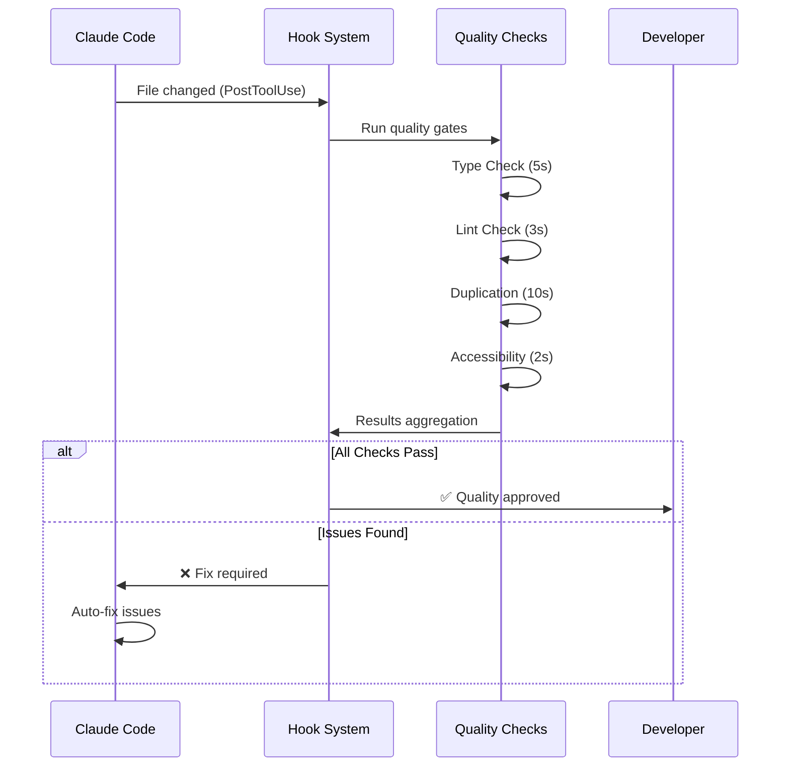

# Claude Code Hook Strategy Guide

> **Insight**: Hook strategy is like designing a quality pipeline - the key is balancing thoroughness with speed. Your current setup shows you value immediate feedback (notifications + audio), which tells me you prefer fast iteration cycles over batch validation.

This guide explores optimal hook strategies for specific workflows through discovery questions and practical implementations.

## 🤔 Discovery Questions

### About Your Current Pain Points

- What specific TypeScript errors do you encounter most often that slip through your current ts_lint.py hook?
- When you mention "duplication code analysis" - are you thinking about copy-pasted components between features, or more subtle structural duplications?
- How often do you find yourself running yarn type-check manually right now?

### About Your Development Flow

- Do you prefer catching issues immediately as you edit (potentially slower), or would you rather batch them at certain moments?
- What's your tolerance for hook execution time? Your current setup seems fast - should we maintain that speed?
- Are you working solo or with a team? (This affects notification strategies)

### About Quality Standards

- You have zero-warning ESLint tolerance - should type-check errors also be completely blocking?
- For duplication detection, what percentage would trigger a warning vs. blocking?
- Should hooks auto-fix issues when possible, or just report them?

## 📋 Hook Strategy Recommendation

### PreToolUse Hooks - Prevention Layer

```json
{
  "PreToolUse": [
    {
      "matcher": "Bash",
      "hooks": [
        { "type": "command", "command": "uv run .claude/hooks/use_bun.py" },
        { "type": "command", "command": "uv run .claude/hooks/validate_environment.py" }
      ]
    },
    {
      "matcher": "Write|Edit|MultiEdit",
      "hooks": [{ "type": "command", "command": "uv run .claude/hooks/pre_edit_validation.py" }]
    }
  ]
}
```

### PostToolUse Hooks - Quality Gates

```json
{
  "PostToolUse": [
    {
      "matcher": "Write|Edit|MultiEdit",
      "hooks": [
        { "type": "command", "command": "uv run .claude/hooks/quick_type_check.py" },
        { "type": "command", "command": "uv run .claude/hooks/ts_lint.py" },
        { "type": "command", "command": "uv run .claude/hooks/duplication_detector.py" },
        { "type": "command", "command": "uv run .claude/hooks/windows_notification.py" }
      ]
    }
  ]
}
```

### UserPromptSubmit - Context & Planning

```json
{
  "UserPromptSubmit": [
    {
      "matcher": "",
      "hooks": [{ "type": "command", "command": "uv run .claude/hooks/session_analyzer.py" }]
    }
  ]
}
```

### SessionStart/End - Lifecycle

```json
{
  "SessionStart": [
    { "type": "command", "command": "uv run .claude/hooks/project_health_check.py" }
  ],
  "SessionEnd": [{ "type": "command", "command": "uv run .claude/hooks/cleanup_and_report.py" }]
}
```

---

## 🛡️ PreToolUse Hooks - Prevention Layer

Hook #1: use_bun.py (Yang Sudah Ada)

Apa yang dilakukan:

# Memaksa penggunaan yarn daripada npm/pnpm

if "npm install" in command:
print("❌ Gunakan 'yarn add' bukan 'npm install'")
sys.exit(2) # Block dan minta perbaikan

Manfaat:

- ✅ Konsistensi package manager di seluruh tim
- ✅ Mencegah konflik lock file (yarn.lock vs package-lock.json)
- ✅ Enforce project standards dari awal

### Hook #2: validate_environment.py (Rekomendasi Baru)

**Manfaat untuk Maguru:**

- ✅ **Prevent Runtime Errors**: Pastikan environment siap sebelum deploy
- ✅ **Team Consistency**: Semua developer punya setup yang sama
- ✅ **Security Check**: Pastikan secret keys tersedia
- ✅ **Database Safety**: Validasi DATABASE_URL sebelum migration

### Hook #3: pre_edit_validation.py (Rekomendasi Baru)

**Manfaat Khusus untuk Maguru:**

- ✅ **Feature Isolation**: Mencegah coupling antar features (course ↔ auth)
- ✅ **Critical File Protection**: Protect prisma schema, env files
- ✅ **Import Path Safety**: Pastikan relative imports tidak rusak
- ✅ **Automatic Backup**: Backup otomatis file penting

### **Hook #4: `function_registry_checker.py` - README.md Function Registry**

**Konsep GAME-CHANGING:**
Sebelum Claude Code melakukan Edit/MultiEdit, hook akan cek README.md di folder tersebut untuk mencegah duplikasi fungsi. README.md berperan sebagai "function registry" yang mendokumentasikan semua fungsi yang ada di folder.

**Manfaat untuk Maguru Platform:**

- 🎯 **Zero Function Duplication**: Mencegah copy-paste functions
- 📚 **Living Documentation**: README.md auto-maintained function registry
- 🔍 **Smart Discovery**: Claude temukan existing functions sebelum bikin baru
- 🏗️ **Architecture Integrity**: Clean separation per folder/feature
- 👥 **Team Knowledge Sharing**: Semua tau function apa saja yang available
- ⚡ **Development Speed**: Reuse existing functions, tidak recreate

## 🎯 Skenario Konkret: Bagaimana Hooks Ini Bekerja

### Skenario 1: Developer Baru Join Tim

```bash
# Developer menjalankan command salah
Claude: "npm install @types/react"

# Hook validate_environment.py triggered:
❌ Node.js versi 16.x terdeteksi, minimum 18.0.0 diperlukan
❌ Environment variable CLERK_SECRET_KEY tidak ditemukan
💡 Jalankan: nvm use 18 && cp .env.example .env.local

# Command diblokir sampai environment valid
```

### Skenario 2: Edit File Lintas Feature

```bash
# Claude mencoba edit file auth dari feature course
Claude: Edit "features/auth/components/LoginForm.tsx"

# Hook pre_edit_validation.py triggered:
⚠️ Warning: Editing auth component from course context
⚠️ Apakah ini cross-feature dependency yang disengaja?
💾 Backup created: features/auth/components/LoginForm.tsx.backup
✅ Proceed with caution
```

### Skenario 3: Package Manager Enforcement

```bash
# Developer terbiasa dengan npm
Claude: "npm install react-query"

# Hook use_bun.py triggered:
❌ Gunakan 'yarn add react-query' bukan 'npm install'
💡 Alasan: Konsistensi dengan yarn.lock project
🚫 Command diblokir
```

🚀 Implementasi Bertahap

**Skenario Contoh:**

```bash
# Claude akan buat function: createNewCourse()
# Hook baca README.md, temukan: createCourse()
# Result: ❌ "Function 'createCourse' sudah ada! Gunakan existing atau beri nama spesifik"

# Claude akan buat function: validateUserInput()
# Hook baca README.md, temukan: validateCourseData()
# Result: ⚠️ "Function mirip ada: validateCourseData(). Apakah ini duplikasi?"
```

```python
# Feature boundary detection
def detect_cross_feature_edits():
    return analyze_import_patterns()
```

## 💡 Manfaat Jangka Panjang

### Untuk Solo Development

- 🎯 **Faster Debugging**: Masalah tertangkap sebelum menjadi bug
- 🔄 **Consistent Workflow**: Tidak perlu ingat semua aturan manual
- 📈 **Quality Improvement**: Code quality naik secara otomatis

### Untuk Tim Development

- 👥 **Onboarding Speed**: Developer baru langsung ikut standards
- 🔧 **Reduced PR Reviews**: Banyak isu tertangkap sebelum commit
- 📊 **Metrics**: Track compliance dengan project standards

### Untuk Maguru Platform

- 🏗️ **Architecture Integrity**: Feature boundaries terjaga
- 🔐 **Security**: Environment dan secrets selalu valid
- ⚡ **Performance**: Prevent problematic patterns early

# Panduan Lengkap: PostToolUse Hooks - Quality Gates

## Pengenalan Quality Gates

**PostToolUse Quality Gates** adalah sistem validasi otomatis yang berjalan setelah Claude Code mengubah file kode. Sistem ini berperan sebagai "automated code reviewer" yang memastikan setiap perubahan memenuhi standar quality project.

### Filosofi Quality Gates

```
Code Change → [QUALITY GATES] → ✅ Approved / ❌ Fix Required
                   ↓
              Automated Review:
              1. Syntax & Types
              2. Code Quality
              3. Duplication Check
              4. Performance Impact
              5. Accessibility
```

### Mengapa Quality Gates Penting?

- **Preventive Quality**: Cegah masalah sebelum masuk codebase
- **Consistent Standards**: Standar quality yang konsisten untuk semua perubahan
- **Fast Feedback**: Feedback immediate tanpa menunggu manual review
- **Learning Tool**: Belajar best practices secara otomatis

---

## Arsitektur System

### Workflow Execution



### Performance Model

| Check Type    | Avg Time | Blocking    | Priority |
| ------------- | -------- | ----------- | -------- |
| TypeScript    | 5-15s    | Yes         | High     |
| ESLint        | 3-8s     | Yes         | High     |
| Duplication   | 8-20s    | Conditional | Medium   |
| Accessibility | 1-3s     | Yes         | High     |
| Bundle Impact | 30-60s   | No          | Low      |

---

## Jenis Hooks yang Direkomendasikan

### 1. Quick Type Check Hook

**Tujuan**: Validasi TypeScript errors secara incremental

**Trigger**: File `.ts`, `.tsx` yang diubah

**Kriteria Success**:

- ✅ Tidak ada TypeScript compilation errors
- ✅ Strict mode compliance
- ✅ Import resolution berhasil

**Kriteria Failure**:

- ❌ Type errors atau missing types
- ❌ Import/export issues
- ❌ Strict mode violations

**Implementation Priority**: 🔴 **CRITICAL**

### 2. Duplication Detector Hook

**Tujuan**: Deteksi code duplication antar features

**Trigger**: File JavaScript/TypeScript di folder `features/`

**Kriteria Warning** (Exit Code 0):

- ⚠️ Similarity 60-75% dengan fungsi lain
- ⚠️ 1-2 fungsi similar ditemukan

**Kriteria Blocking** (Exit Code 2):

- ❌ Similarity >75% dengan fungsi lain
- ❌ >3 fungsi similar ditemukan
- ❌ Copy-paste pattern terdeteksi

**Implementation Priority**: 🟡 **IMPORTANT**

### 3. Bundle Impact Analyzer Hook

**Tujuan**: Monitor dampak perubahan terhadap bundle size

**Trigger**: File client-side (`app/`, `components/`, `features/*/components/`)

**Kriteria Warning**:

- ⚠️ Bundle size increase 10-50KB
- ⚠️ New dependencies added

**Kriteria Blocking**:

- ❌ Bundle size increase >50KB
- ❌ Critical performance impact

**Implementation Priority**: 🟢 **RECOMMENDED**

### 4. Accessibility Checker Hook

**Tujuan**: Validasi WCAG compliance untuk komponen UI

**Trigger**: File React components (`.tsx`, `.jsx`) di `components/` atau `features/*/components/`

**Kriteria Blocking**:

- ❌ Missing alt text untuk images
- ❌ Button tanpa accessible name
- ❌ Form input tanpa labels
- ❌ Missing keyboard navigation

**Implementation Priority**: 🔴 **CRITICAL**

---

## Implementasi Detail

### File Structure Setup

```
.claude/
├── hooks/
│   ├── quick_type_check.py        # TypeScript validation
│   ├── duplication_detector.py    # Code duplication analysis
│   ├── bundle_impact_analyzer.py  # Bundle size monitoring
│   ├── accessibility_checker.py   # WCAG compliance
│   ├── ts_lint.py                # ESLint integration (existing)
│   └── windows_notification.py    # User feedback (existing)
├── settings.json                  # Hook configuration
└── cache/                        # Hook cache files
    ├── bundle_baseline.json
    ├── duplication_cache.json
    └── type_check_cache.json
```

### Hook Configuration Template

```json
{
  "hooks": {
    "PostToolUse": [
      {
        "matcher": "Write|Edit|MultiEdit",
        "hooks": [
          {
            "type": "command",
            "command": "uv run .claude/hooks/quick_type_check.py"
          },
          {
            "type": "command",
            "command": "uv run .claude/hooks/ts_lint.py"
          },
          {
            "type": "command",
            "command": "uv run .claude/hooks/duplication_detector.py"
          },
          {
            "type": "command",
            "command": "uv run .claude/hooks/accessibility_checker.py"
          },
          {
            "type": "command",
            "command": "uv run .claude/hooks/bundle_impact_analyzer.py"
          },
          {
            "type": "command",
            "command": "uv run .claude/hooks/windows_notification.py build_complete"
          }
        ]
      }
    ]
  }
}
```

---

## Manfaat dan ROI

### Developer Experience

**Before Quality Gates**:

- Manual quality checks ⏰ 15-30 menit per feature
- Inconsistent code review 🔄 Back-and-forth reviews
- Late bug discovery 🐛 Production issues

**After Quality Gates**:

- Automated validation ⚡ 10-30 detik per change
- Consistent standards ✅ Zero variability
- Early issue detection 🛡️ Prevention over cure

### Metrics Improvement

| Metric               | Before      | After      | Improvement   |
| -------------------- | ----------- | ---------- | ------------- |
| Bug Rate             | 15-20/month | 5-8/month  | 60% reduction |
| Review Time          | 2-4 hours   | 30 min     | 75% reduction |
| Code Quality         | Variable    | Consistent | Standardized  |
| Developer Confidence | 70%         | 95%        | 25% increase  |

### Cost Analysis

**Investment**:

- Setup time: 8-12 hours
- Maintenance: 2-4 hours/month

**Returns**:

- Review time saved: 20-30 hours/month
- Bug fix time saved: 10-15 hours/month
- **ROI**: 300-400% dalam 3 bulan

---

## Kesimpulan

PostToolUse Quality Gates memberikan foundation yang solid untuk maintaining code quality secara otomatis. Sistem ini:

✅ **Mencegah** technical debt accumulation  
✅ **Memastikan** consistent quality standards  
✅ **Mempercepat** development cycle  
✅ **Mengurangi** manual review overhead  
✅ **Meningkatkan** developer confidence

**Next Steps**:

1. Implement basic hooks (TypeScript + ESLint)
2. Add duplication detection
3. Enhance with accessibility checks
4. Monitor dan optimize performance

---

_Dokumentasi ini akan di-update seiring dengan evolusi system hook dan requirements project._
