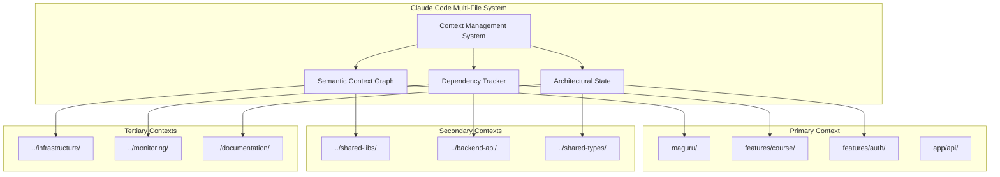
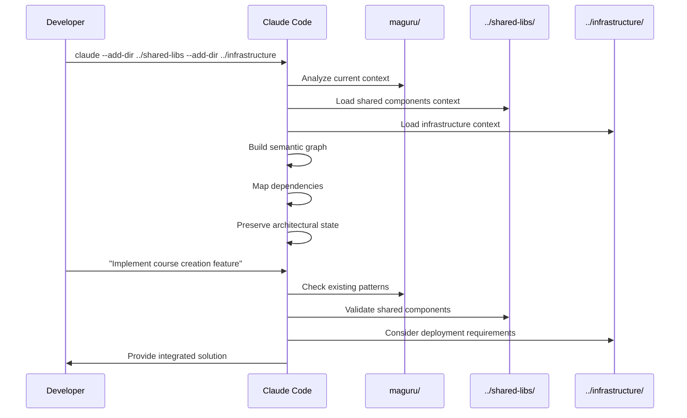
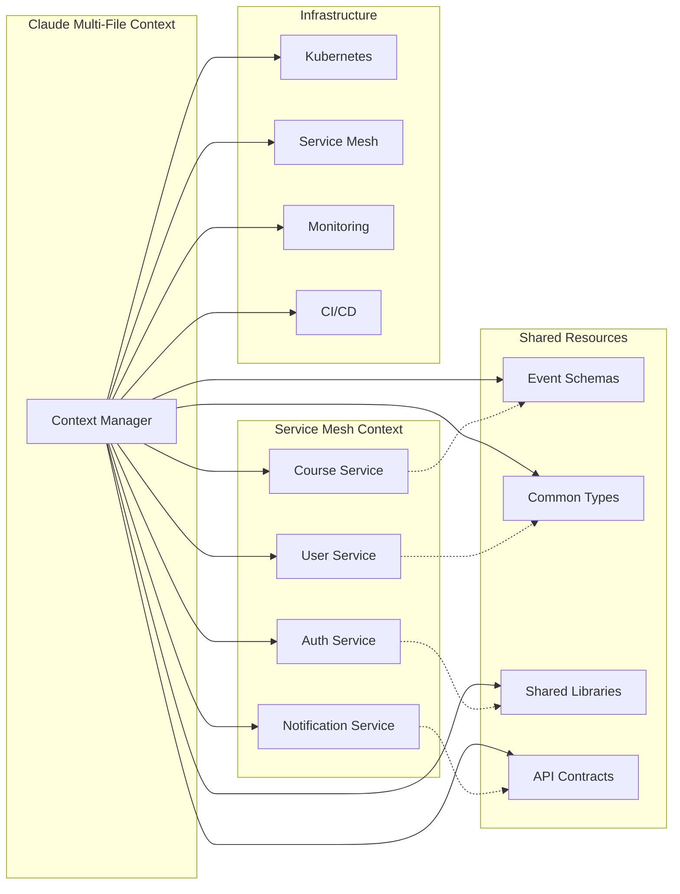
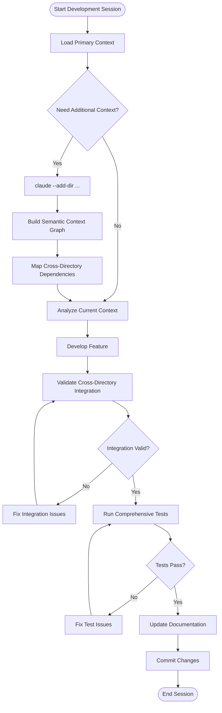

# Multi-File System: Architecture Diagrams & Best Practices

## Architecture Patterns

### 1. Context Orchestration Architecture



### 2. Feature-First Multi-Directory Flow



### 3. Microservices Context Management



### 4. Development Workflow Architecture



## Best Practice Patterns

### 1. Context Loading Strategy Matrix

| Project Complexity | Directories | Loading Pattern | Performance Strategy |
|-------------------|-------------|-----------------|---------------------|
| **Simple** | 1-3 | `claude --add-dir ../backend` | Full context loading |
| **Moderate** | 4-7 | `claude --add-dir ../services --scope module` | Selective loading |
| **Complex** | 8-15 | `claude --add-dir ../services --concurrency 3` | Parallel loading |
| **Enterprise** | 15+ | `claude --add-dir ../critical --lazy-load` | Federated context |

### 2. Directory Hierarchy Patterns

#### Pattern A: Feature-First Monolith
```
project-root/
├── main-app/                    # Primary (Current Directory)
│   ├── features/course/
│   ├── features/auth/
│   └── shared/components/
├── shared-libraries/            # Secondary
│   ├── ui-components/
│   ├── utilities/
│   └── types/
└── infrastructure/              # Tertiary
    ├── docker/
    ├── kubernetes/
    └── monitoring/

Usage: claude --add-dir ../shared-libraries --add-dir ../infrastructure
```

#### Pattern B: Microservices Architecture
```
microservices-root/
├── course-service/              # Primary (Current Directory)
│   ├── src/handlers/
│   ├── src/models/
│   └── tests/
├── shared/                      # Secondary
│   ├── event-schemas/
│   ├── common-types/
│   └── client-libraries/
├── user-service/                # Peer Service
│   ├── src/handlers/
│   └── src/models/
└── infrastructure/              # Tertiary
    ├── service-mesh/
    ├── observability/
    └── deployment/

Usage: claude --add-dir ../shared --add-dir ../user-service --add-dir ../infrastructure
```

#### Pattern C: Full-Stack Monorepo
```
monorepo-root/
├── frontend/                    # Primary (Current Directory)
│   ├── src/components/
│   ├── src/pages/
│   └── src/hooks/
├── backend/                     # Secondary
│   ├── api/routes/
│   ├── services/
│   └── models/
├── shared/                      # Secondary
│   ├── types/
│   ├── constants/
│   └── utilities/
├── mobile/                      # Peer Application
│   ├── src/screens/
│   └── src/components/
└── devops/                      # Tertiary
    ├── ci-cd/
    ├── infrastructure/
    └── monitoring/

Usage: claude --add-dir ../backend --add-dir ../shared --add-dir ../devops
```

### 3. Context Scope Management

#### Scope Hierarchy
```
--scope system     # Full system analysis (slowest, most comprehensive)
--scope project    # Project-level analysis (balanced)
--scope module     # Module-focused analysis (fast, targeted)
--scope file       # File-level analysis (fastest, most focused)
```

#### Usage Examples
```bash
# System-wide architecture review
claude --add-dir ../services --add-dir ../infra --scope system --think-hard

# Feature development session
claude --add-dir ../backend --add-dir ../shared --scope module

# Bug fix or small change
claude --add-dir ../tests --scope file
```

### 4. Performance Optimization Strategies

#### Parallel Loading Pattern
```bash
# Efficient parallel context loading
claude --add-dir ../service-1 --add-dir ../service-2 --add-dir ../shared --concurrency 5

# Benefits:
# - Simultaneous context analysis
# - Reduced startup time
# - Better resource utilization
```

#### Lazy Loading Pattern
```bash
# Memory-efficient lazy loading
claude --add-dir ../large-codebase --lazy-load --scope module

# Benefits:
# - Lower memory footprint
# - Context loaded on-demand
# - Better performance for large projects
```

#### Token Efficiency Pattern
```bash
# Compressed communication for large contexts
claude --add-dir ../services --add-dir ../docs --uc --token-efficient

# Benefits:
# - 30-50% token reduction
# - Faster response times
# - Better context preservation
```

## Integration Patterns

### 1. API Integration Pattern

```typescript
// Primary: frontend/src/hooks/useCourseApi.ts
export const useCourseApi = () => {
  const createCourse = async (data: CourseCreateRequest) => {
    // Claude validates this against ../backend/types/CourseTypes.ts
    return await api.post('/courses', data)
  }
}

// Secondary: ../backend/types/CourseTypes.ts  
export interface CourseCreateRequest {
  title: string
  description: string
  categoryId: string
  // Claude ensures consistency with frontend usage
}

// Claude Multi-File System Benefits:
// - Type consistency validation
// - API contract verification
// - Error handling alignment
// - Performance optimization suggestions
```

### 2. Event-Driven Integration Pattern

```typescript
// Primary: course-service/src/handlers/courseHandler.ts
export const createCourse = async (data: CourseCreateRequest) => {
  const course = await courseRepository.create(data)
  
  // Claude validates event schema against ../shared/events/CourseEvents.ts
  await eventBus.publish('course.created', {
    courseId: course.id,
    userId: data.createdBy,
    timestamp: new Date()
  })
}

// Secondary: ../shared/events/CourseEvents.ts
export interface CourseCreatedEvent {
  courseId: string
  userId: string
  timestamp: Date
  // Claude ensures all services use consistent schema
}

// Tertiary: ../user-service/src/handlers/courseEventHandler.ts
eventBus.subscribe('course.created', async (event: CourseCreatedEvent) => {
  // Claude validates event structure consistency
  await updateUserCourseStats(event.userId, event.courseId)
})
```

### 3. Infrastructure Integration Pattern

```yaml
# Primary: course-service/k8s/deployment.yaml
apiVersion: apps/v1
kind: Deployment
metadata:
  name: course-service
spec:
  replicas: 3
  template:
    spec:
      containers:
      - name: course-service
        image: course-service:latest
        resources:
          requests:
            memory: "512Mi"
            cpu: "250m"
```

```terraform
# Secondary: ../infrastructure/terraform/services.tf
resource "kubernetes_deployment" "course_service" {
  # Claude validates resource consistency with k8s manifests
  metadata {
    name = "course-service"
  }
  
  spec {
    replicas = 3  # Claude ensures consistency with deployment.yaml
  }
}
```

## Advanced Patterns

### 1. Cross-Repository Development

```bash
# Multi-repository development session
claude --add-dir ../course-service-repo --add-dir ../shared-types-repo --add-dir ../infrastructure-repo

# Scenarios:
# - Breaking change impact analysis across repos
# - Shared library version upgrade planning
# - Cross-repo refactoring coordination
# - Documentation synchronization
```

### 2. Legacy Migration Pattern

```bash
# Legacy modernization session
claude --add-dir ../legacy-monolith --add-dir ../new-microservices --add-dir ../migration-tools

# Activities:
# - Extract service boundaries from monolith
# - Design modern API contracts
# - Plan data migration strategy
# - Create integration testing approach
```

### 3. Multi-Environment Management

```bash
# Environment-aware development
claude --add-dir ../app --add-dir ../config/dev --add-dir ../config/prod --add-dir ../infrastructure

# Benefits:
# - Environment-specific configuration validation
# - Deployment pipeline consistency
# - Configuration drift detection
# - Environment parity verification
```

## Troubleshooting Guide

### Performance Issues

#### Problem: Slow Context Loading
```bash
# Diagnosis
claude --add-dir ../large-repo --debug --profile

# Solutions
claude --add-dir ../large-repo --scope module --lazy-load
claude --add-dir ../critical-only --exclude-patterns="node_modules,*.log"
```

#### Problem: Memory Constraints
```bash
# Diagnosis
claude --add-dir ../services --memory-usage

# Solutions  
claude --add-dir ../services --concurrency 2 --token-efficient
claude --add-dir ../essential-services --scope file
```

### Integration Issues

#### Problem: Type Inconsistencies
```bash
# Diagnosis
claude --add-dir ../frontend --add-dir ../backend --validate-types

# Solutions
claude --add-dir ../frontend --add-dir ../backend --generate-types
claude --add-dir ../shared-types --sync-types
```

#### Problem: API Contract Mismatches
```bash
# Diagnosis
claude --add-dir ../api-client --add-dir ../api-server --validate-contracts

# Solutions
claude --add-dir ../api-specs --add-dir ../implementations --sync-contracts
```

## Monitoring and Observability

### Context Health Metrics

```bash
# Context health check
claude --add-dir ../services --health-check

# Metrics to monitor:
# - Context loading time
# - Memory usage per directory
# - Cross-directory dependency count
# - Integration consistency score
```

### Performance Metrics

```bash
# Performance analysis
claude --add-dir ../app --add-dir ../infra --performance-analysis

# Key metrics:
# - Context switching overhead
# - Cross-directory analysis time
# - Memory footprint per context
# - Token usage efficiency
```

## Future Evolution Patterns

### 1. AI-Assisted Architecture Evolution

- **Architectural Drift Detection**: Automatic identification of architecture pattern violations
- **Refactoring Suggestions**: AI-powered suggestions for improving cross-directory structure
- **Dependency Optimization**: Intelligent dependency graph optimization recommendations

### 2. Enhanced Context Persistence

- **Session Continuity**: Seamless context preservation across development sessions
- **Team Context Sharing**: Shared architectural understanding across team members
- **Historical Context Analysis**: Analysis of architectural evolution over time

### 3. Integration Ecosystem Expansion

- **IDE Integration**: Deep integration with popular IDEs for context-aware development
- **CI/CD Pipeline Integration**: Automated multi-directory validation in build processes
- **Monitoring Integration**: Real-time architectural health monitoring and alerts

This architecture documentation provides the foundation untuk leveraging Multi-File System effectively dalam complex development scenarios, ensuring optimal performance dan architectural coherence across distributed codebases.