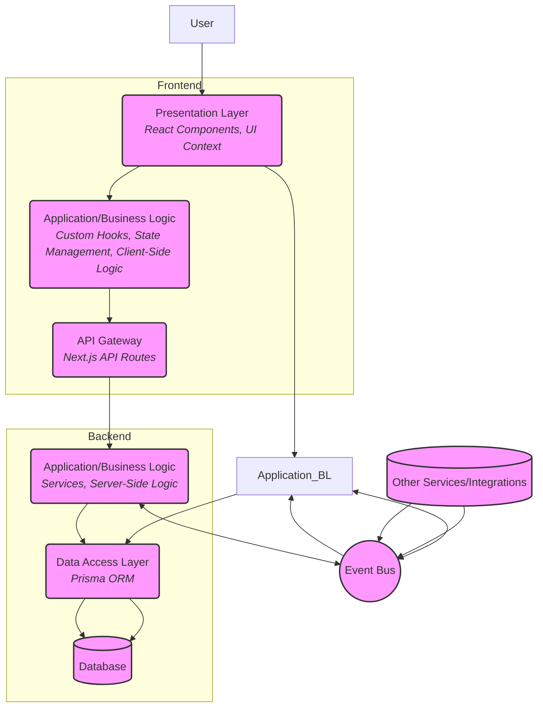

# 📐 Arsitektur Proyek Maguru

## Daftar Isi

- [Pendahuluan](#pendahuluan)
- [High Level Architecture](#high-level-architecture)
- [Struktur Folder & Mapping Layer](#struktur-folder--mapping-layer)
- [Modular Boundaries & Feature-First](#modular-boundaries--feature-first)
- [Layered Architecture (3-Tier)](#layered-architecture-3-tier)
- [Event-Driven Hybrid](#event-driven-hybrid)
- [Komponen Arsitektur Detil](#komponen-arsitektur-detil)
- [Alur Data End-to-End](#alur-data-end-to-end)
- [Konvensi Penamaan](#konvensi-penamaan)
- [Patterns dan Best Practices](#patterns-dan-best-practices)
- [Tech Stack dan Dependencies](#tech-stack-dan-dependencies)
- [Best Practice & Onboarding](#best-practice--onboarding)

---

## Pendahuluan

Dokumen ini menjelaskan arsitektur proyek Maguru yang mengadopsi kombinasi pendekatan **Modular Monolith (Feature-First)**, **Layered (3-Tier)**, dan **Event-Driven Hybrid**. Arsitektur ini dirancang untuk membangun aplikasi web yang scalable, maintainable, dan kokoh menggunakan Next.js App Router dan TypeScript. Tujuannya adalah agar setiap kontributor baru dapat memahami alur kerja, standar, dan struktur kode dengan cepat dan konsisten.

Arsitektur ini dirancang untuk:

- Mengorganisir kode berdasarkan fitur (Feature-First) di dalam struktur Modular Monolith.
- Memisahkan tanggung jawab secara vertikal (Layered 3-Tier) untuk meningkatkan maintainability.
- Mendukung komunikasi event-driven antar bagian aplikasi untuk fleksibilitas dan decoupling (Event-Driven Hybrid).
- Memastikan kualitas kode melalui konvensi, pengujian, dan proses review.

---

## High Level Architecture

Maguru menggunakan kombinasi arsitektur berikut:

-   **Modular Monolith (Feature-First):** Aplikasi dibangun sebagai monolit, namun kode diorganisir menjadi modul-modul fitur yang relatif independen di dalam direktori `/features`. Setiap fitur mencakup semua lapisan yang diperlukan (UI, logika, akses data) untuk mengurangi ketergantungan antar fitur.
-   **Layered (3-Tier):** Kode dipecah menjadi lapisan horizontal logis untuk memisahkan tanggung jawab: Presentation, Application/Business Logic, dan Data Access. Ini membatasi ketergantungan antar lapisan (umumnya hanya ke bawah).
-   **Event-Driven Hybrid:** Selain komunikasi request/response sinkron, aplikasi juga dapat menggunakan mekanisme event (seperti event bus, message queue, atau React Context for UI events) untuk komunikasi asinkron antar bagian yang berbeda, mendukung decoupling dan skalabilitas.

### Diagram Arsitektur Tingkat Tinggi



---

## Struktur Folder & Mapping Layer

Struktur folder utama dan pemetaan ke layer arsitektur proyek secara keseluruhan:

```
/
├── app/                # Next.js App Router: Routing, Root Layout, API Routes
│   ├── [...]/          # Route segments (Presentation Layer)
│   └── api/            # API Routes (Entry point to Application/Business Logic Layer)
├── features/           # Feature Modules (Modular Monolith - Semua layer per fitur)
│   └── [feature-name]/ # Contoh: manage-module
│       ├── components/ # Presentation Layer (UI Components)
│       ├── context/    # State Management Layer (Client-side Business Logic)
│       ├── hooks/      # Business Logic Layer (Client-side Orchestration)
│       ├── adapters/   # Data Access Layer (Client-side interface to API)
│       ├── services/   # Business Logic Layer (Server-side Services)
│       ├── lib/        # Feature-specific Utilities
│       └── types/      # Feature-specific Types & Schemas
├── docs/               # Dokumentasi, Arsitektur Global, dll.
├── lib/                # Shared Utilities & Libraries (Cross-cutting Concerns)
├── prisma/             # Database Schema & Migrations (Data Access Layer configuration)
├── public/             # Static Assets
├── __tests__/          # Testing (mocks, integration, e2e)
└── tsconfig.json       # TypeScript Configuration (Type Safety)
```

**Mapping Layer pada Arsitektur 3-Tier Proyek:**

*   **Presentation Layer:**
    *   `app/` (Pages, Layouts)
    *   `features/*/components/`
    *   `features/*/context/` (Khusus untuk UI State Contexts)
*   **Application/Business Logic Layer:**
    *   `app/api/` (API Routes - Server-side Entry Point)
    *   `features/*/hooks/` (Client-side Logic Orchestration)
    *   `features/*/context/` (Khusus untuk State Management Logic & Data State Contexts seperti React Query context)
    *   `features/*/services/` (Server-side Business Logic)
    *   `lib/` (Shared Business Logic Utilities)
*   **Data Access Layer:**
    *   `features/*/adapters/` (Client-side interface to API)
    *   `features/*/services/` (Interaksi dengan ORM/DB)
    *   `prisma/` (ORM configuration)
    *   Database (Eksternal)

Diagram Alur Data End-to-End di bagian selanjutnya akan memberikan pemetaan yang lebih visual.

---

## Modular Boundaries & Feature-First

Modular Boundaries & Feature-First adalah konsep kunci dalam mengorganisir kode di Maguru. Setiap fitur utama (misalnya, `manage-module`, `user-profile`, `notification-settings`) memiliki direktori sendiri di dalam `/features`. Direktori fitur ini berisi semua kode yang diperlukan untuk fitur tersebut, mencakup komponen UI, logika bisnis (hooks, services), akses data (adapters), types, dan utilitas khusus fitur.

Tujuannya adalah untuk:
- **Isolasi:** Membatasi ketergantungan langsung antar fitur. Fitur seharusnya hanya berinteraksi melalui API (request/response) atau Event Bus.
- **Maintainability:** Perubahan dalam satu fitur memiliki dampak minimal pada fitur lain.
- **Scalability:** Tim yang berbeda dapat bekerja pada fitur yang berbeda secara paralel.
- **Testability:** Fitur dapat diuji sebagai unit yang relatif mandiri.

Struktur di dalam direktori fitur (`features/[feature-name]`) mencerminkan Layered Architecture, memastikan bahwa bahkan di dalam modul monolit, tanggung jawab tetap terpisah.

---

## Layered Architecture (3-Tier)

Arsitektur 3-Tier di Maguru bertujuan untuk memisahkan tanggung jawab aplikasi menjadi tiga lapisan utama agar kode lebih terstruktur, mudah dipelihara, dan scalable. Berikut penjelasan singkat dan jelas tiap lapisan beserta contoh implementasinya di Maguru:


### 1. **Presentation Layer (Lapisan Presentasi/UI)**
Lapisan ini menangani semua yang berhubungan dengan tampilan dan interaksi pengguna.

- **Tugas utama:** 
  - Menampilkan UI (User Interface)
  - Menerima dan memproses input dari user
  - Menampilkan data ke user

- **Contoh implementasi di Maguru:**
  - **React Components**
    - Server Components: di folder `app/`
    - Client Components: di `features/*/components`
  - **Context API** untuk state yang berkaitan langsung dengan UI (misal: status sidebar, tab aktif)


### 2. **Application/Business Logic Layer (Lapisan Logika Bisnis & Aplikasi)**
Lapisan ini berisi aturan bisnis, proses utama aplikasi, dan mengatur alur data antara UI dan data.

- **Tugas utama:**
  - Menyimpan dan mengelola state aplikasi (bukan hanya UI)
  - Menjalankan aturan bisnis
  - Mengorkestrasi proses (misal: validasi, transformasi data, workflow)

- **Contoh implementasi di Maguru:**
  - **Client-side:**
    - Custom Hooks (`features/*/hooks`) untuk mengatur alur kerja user dan memanggil adapter
    - State Management (React Query, Context API untuk state non-UI)
  - **Server-side:**
    - API Routes (`app/api/`) sebagai pintu masuk request, validasi, dan otentikasi
    - Services (`features/*/services`) yang berisi logika bisnis utama dan interaksi ke database


### 3. **Data Access Layer (Lapisan Akses Data)**
Lapisan ini bertanggung jawab untuk semua interaksi dengan sumber data (database, API eksternal, dsb).

- **Tugas utama:**
  - Mengambil, menyimpan, dan memodifikasi data di database atau sumber data lain
  - Mengabstraksi detail teknis data dari lapisan di atasnya

- **Contoh implementasi di Maguru:**
  - **Adapters** (`features/*/adapters`): antarmuka client-side ke API backend
  - **Prisma ORM** dan kode terkait di Services (server-side) untuk akses database


**Alur Ketergantungan:**
- Umumnya, alur data dan ketergantungan berjalan dari atas ke bawah:
  - Presentation Layer → Application/Business Logic Layer → Data Access Layer
- Namun, ada juga komunikasi bolak-balik, misal saat Application Logic meminta data ke Data Access, lalu hasilnya dikirim kembali ke Presentation Layer.


---

## Event-Driven Hybrid

Maguru menggunakan pendekatan **Event-Driven Hybrid** untuk melengkapi komunikasi sinkron (Request/Response) yang umum pada arsitektur berlapis, dengan komunikasi asinkron berbasis event. Pendekatan ini membuat sistem lebih fleksibel, mudah dikembangkan, dan responsif.

#### Apa itu Event-Driven Hybrid?

Pada dasarnya, sistem ini menggabungkan dua cara komunikasi:
- **Sinkron (Request/Response):** Komponen A memanggil komponen B dan menunggu hasilnya secara langsung.
- **Asinkron (Event-Driven):** Komponen A hanya mengumumkan bahwa sesuatu telah terjadi (event), lalu komponen lain yang tertarik akan bereaksi tanpa A perlu tahu siapa yang mendengarkan.


#### Manfaat Pendekatan Event-Driven Hybrid

- **Decoupling (Pemisahan Ketergantungan):** Fitur atau service bisa saling bereaksi tanpa saling memanggil secara langsung. Contoh: Ketika event `ModulePublished` dipancarkan oleh `manage-module`, service notifikasi bisa mengirim pesan tanpa perlu dihubungi langsung oleh `manage-module`.
- **Scalability & Responsiveness:** Proses yang berat atau lambat bisa dijalankan secara asinkron oleh listener, sehingga tidak menghambat proses utama.
- **Flexibility:** Listener baru bisa ditambahkan untuk bereaksi pada event yang sama tanpa perlu mengubah kode emitter.


> **Catatan:** Detail implementasi event-driven untuk modul `manage-module` akan dijelaskan lebih lanjut di dokumen arsitektur modul tersebut. Penjelasan di atas adalah prinsip umum yang berlaku di seluruh sistem Maguru.

---

## Komponen Arsitektur Detail

Bagian ini menjelaskan komponen utama yang membangun arsitektur setiap fitur di Maguru, baik di tingkat fitur maupun proyek secara keseluruhan. Penjelasan berikut bertujuan agar lebih mudah dipahami dan jelas.

1. **React Components**
   - Bertugas membangun tampilan (UI) aplikasi.
   - Terbagi menjadi dua jenis sesuai praktik Next.js:
     - **Server Components:** Untuk rendering awal, data fetching, dan SEO.
     - **Client Components:** Untuk interaktivitas, event handling, dan state lokal.
   - Berada di lapisan Presentasi (Presentation Layer).

2. **State Management**
   - Mengelola data dan status aplikasi.
   - Terdiri dari:
     - **UI State:** Menggunakan Context API untuk state yang berkaitan dengan tampilan (misal: sidebar, tab aktif).
     - **Server State:** Menggunakan React Query untuk data dari API, termasuk caching, loading, dan error state.
   - Berada di lapisan Presentasi & Logika Bisnis Aplikasi (Presentation & Application/Business Logic Layer).

3. **Custom Hooks**
   - Mengabstraksi logika komponen agar kode lebih modular dan mudah digunakan ulang.
   - Terdiri dari dua tipe:
     - **Low-Level Hooks:** Berinteraksi langsung dengan Adapter atau API (misal: mengambil data, melakukan mutasi).
     - **High-Level Hooks:** Menggabungkan beberapa low-level hooks untuk menjalankan logika bisnis yang lebih kompleks.
   - Berada di lapisan Logika Bisnis Aplikasi (Application/Business Logic Layer).

4. **Adapters**
   - Berfungsi sebagai jembatan antara frontend dan backend (API).
   - Bertanggung jawab mengirim request ke API, memformat data, dan menangani error dasar.
   - Berada di lapisan Akses Data (Data Access Layer).

5. **API Routes**
   - Merupakan handler API di Next.js yang menerima request HTTP dari frontend.
   - Menjadi entry point ke Service Layer di backend.
   - Berada di lapisan Logika Bisnis Aplikasi (Application/Business Logic Layer entry point).

6. **Services**
   - Menyimpan logika bisnis inti aplikasi.
   - Berinteraksi dengan database (melalui ORM seperti Prisma).
   - Dapat memancarkan event jika ada aksi penting.
   - Berada di lapisan Logika Bisnis Aplikasi (Application/Business Logic Layer).

7. **Prisma ORM**
   - Digunakan di Service Layer untuk berinteraksi dengan database secara type-safe.
   - Berada di lapisan Akses Data (Data Access Layer).

8. **Utils & Types**
   - Kumpulan fungsi pembantu (helper), tipe TypeScript, dan skema validasi (Zod).
   - Bisa bersifat umum (di `lib/`) atau spesifik fitur (di `features/*/lib` atau `features/*/types`).
   - Digunakan di berbagai layer sebagai cross-cutting concerns.


---

## Alur Data End-to-End

Memahami alur data sangat penting. Berikut adalah contoh alur data tipikal dalam arsitektur Maguru:

### 1. Alur Interaksi Pengguna (Aksi dari Client)

Berikut adalah penjelasan langkah demi langkah bagaimana data mengalir ketika pengguna melakukan aksi di aplikasi (misal: klik tombol "Save"):

1.  **Pengguna melakukan aksi di UI**  
    Contoh: Pengguna mengklik tombol "Save" pada halaman.

2.  **Komponen Client menangkap event**  
    Komponen React di sisi client (Client Component) memiliki event handler (misal: `onClick`) yang akan dijalankan saat aksi terjadi.

3.  **Komponen memanggil Custom Hook**  
    Di dalam event handler, komponen akan memanggil custom hook yang sudah dibuat untuk menangani logika bisnis terkait aksi tersebut.

4.  **Custom Hook menjalankan operasi data**  
    Custom hook ini bisa menggunakan React Query (untuk mutasi data) atau memanggil fungsi adapter untuk berkomunikasi dengan backend.

5.  **Adapter mengirim request ke API**  
    Adapter bertugas membuat request HTTP (seperti POST atau PUT) ke API Route di backend, sekaligus memformat data yang dikirim.

6.  **API Route menerima dan memproses request**  
    API Route di Next.js menerima request dari adapter, lalu melakukan validasi data, otentikasi, dan memanggil service yang sesuai untuk memproses permintaan.

7.  **Service menjalankan logika bisnis**  
    Service di backend menjalankan aturan bisnis utama, melakukan validasi tambahan jika perlu, dan menyiapkan data untuk disimpan atau diambil dari database.

8.  **Service berinteraksi dengan database**  
    Service menggunakan Prisma ORM untuk membaca atau menulis data ke database secara aman dan type-safe.

9.  **(Opsional) Service memancarkan event**  
    Jika aksi yang dilakukan penting (misal: data baru berhasil disimpan), service dapat memancarkan event ke Event Bus untuk diproses lebih lanjut (misal: notifikasi, logging, dsb).

10. **Response dikembalikan ke client**  
    Hasil dari operasi (berhasil/gagal, data baru, dsb) dikembalikan secara berurutan: dari Service → API Route → Adapter → Custom Hook → Komponen Client.

11. **UI diperbarui sesuai hasil**  
    State aplikasi di client (misal: melalui React Query atau Context API) diperbarui berdasarkan response, sehingga UI menampilkan perubahan terbaru kepada pengguna.


### 2. Alur Server-side Rendering & Data Fetching (SSR)

Berikut adalah penjelasan langkah demi langkah proses pengambilan data dan rendering halaman di server menggunakan Next.js:

1.  **Browser meminta halaman**  
    Pengguna mengakses atau menavigasi ke halaman tertentu, misalnya `/manage-module/[moduleId]`.

2.  **Next.js menerima dan merutekan permintaan ke Server Component**  
    Next.js akan mengarahkan permintaan tersebut ke file Server Component yang sesuai, misalnya `app/manage-module/[moduleId]/page.tsx`.

3.  **Server Component mengambil data awal (Data Fetching)**  
    Di dalam Server Component, dilakukan pemanggilan ke Service atau Adapter untuk mengambil data yang dibutuhkan.  
    - Jika Adapter digunakan di server, maka Adapter akan dipanggil.  
    - Jika tidak, bisa langsung fetch ke API internal atau langsung ke Service.  
    Contoh kode:  
    ```ts
    const data = await modulePageService.getModulePages(moduleId);
    ```

4.  **Service mengambil data dari database**  
    Service (lapisan logika aplikasi di server) akan menggunakan Prisma (Data Access Layer) untuk mengambil data dari database secara aman dan terstruktur.

5.  **Data dikembalikan ke Server Component**  
    Data hasil query dari Service atau database akan diterima kembali oleh Server Component.

6.  **Server Component merender HTML beserta data**  
    Server Component akan merender halaman beserta data yang sudah diambil.  
    - Jika ada Client Component di dalamnya, data awal bisa diberikan melalui props atau state management (misal: React Query).  
    - Hasil render berupa HTML dikirim ke browser.

7.  **Client Hydration (Aktivasi interaktivitas di browser)**  
    Setelah HTML diterima browser, JavaScript akan dimuat.  
    - Client Component menjadi interaktif (bisa menangani event, dsb).  
    - Jika menggunakan React Query, data awal dari server akan digunakan sebagai initial data, lalu React Query akan melanjutkan pengelolaan state data di sisi client.

Dengan alur ini, pengguna akan mendapatkan halaman yang sudah berisi data sejak awal (cepat dan SEO-friendly), serta tetap mendapatkan interaktivitas penuh setelah JavaScript termuat.

---

## Konvensi Penamaan

Konsistensi penamaan sangat penting untuk maintainability dan pemahaman kode. Berikut adalah konvensi umum yang diadopsi:

*   **File dan Direktori:** Lowercase dengan hyphen (`kebab-case`). Contoh: `folder-item`, `use-module-page`, `folder-service`. Direktori fitur di `/features` juga menggunakan `kebab-case`.
*   **React Components (Files & Nama):** PascalCase. Contoh: `FolderItem.tsx`, `ModulePageSidebar`.
*   **Props Types:** Nama Komponen + `Props`. Contoh: `FolderItemProps`.
*   **Event Handlers:** Prefix `handle` + Nama Event (CamelCase). Contoh: `handleFolderClick`, `handlePageSelect`.
*   **Context (Files & Nama):** Deskripsi Tujuan + `Context`. Contoh: `ModulePageUIContext.tsx`.
*   **Provider (Nama):** Deskripsi Tujuan + `Provider`. Contoh: `ModulePageUIProvider`.
*   **Hooks (Files & Nama):** Prefix `use` + Nama Fungsi/Fitur (CamelCase). Contoh: `useModulePageOperation.ts`, `useInlineEditing`.
    *   Low-Level Hooks: `use<Entity>Data` atau `use<Entity><Operation>`. Contoh: `useFolderData`, `useGetPage`.
    *   High-Level Hooks: `use<Feature>Operation` atau `use<Feature>UI`. Contoh: `useManageModuleOperation`, `useModulePageUI`.
*   **Adapters (Files & Nama):** Deskripsi Entitas + `Adapter.ts`. Contoh: `folderAdapter.ts`, `pageAdapter.ts`. Fungsi di dalamnya menggunakan `camelCase` dan sering diakhiri dengan `Adapter` jika ada potensi kebingungan dengan service function (misal: `createFolderAdapter`).
*   **Services (Files & Nama):** Deskripsi Entitas + `Service.ts`. Contoh: `folderService.ts`, `pageService.ts`. Fungsi di dalamnya menggunakan `camelCase` dan sering diakhiri dengan `Service` untuk membedakan dari adapter atau hooks (misal: `createFolderService`).
*   **Types (Files & Nama):** PascalCase untuk nama tipe/interface. File menggunakan `kebab-case` atau `index.ts` untuk ekspor. Contoh: `FolderData`, `PageType`, `module-page-types.ts`, `index.ts`. Skema validasi Zod menggunakan suffix `Schema` (e.g., `folderSchema`).
*   **API Routes (Files):** Mengikuti konvensi Next.js (`route.ts`). Fungsi handler menggunakan nama HTTP method (GET, POST, PUT, DELETE).
*   **Utilitas (Files & Nama):** Deskriptif, camelCase atau PascalCase tergantung apakah itu file fungsi atau kelas. Contoh: `formatDate.ts`, `ApiResponse.ts`.

---

## Patterns dan Best Practices

Arsitektur Maguru mendorong penggunaan pattern dan praktik terbaik untuk meningkatkan kualitas kode:

*   **Feature-First Structure:** Seperti dijelaskan sebelumnya, organisasi kode berdasarkan fitur adalah kunci.
*   **Layered Architecture:** Pemisahan tanggung jawab antar layer (Presentation, Application Logic, Data Access).
*   **Composition Pattern:** Membangun UI dan logika dari komponen-komponen yang lebih kecil dan dapat digunakan kembali.
*   **Separation of Concerns:** Memastikan setiap modul, komponen, atau fungsi memiliki satu tanggung jawab yang jelas.
*   **Dependency Injection:** Menggunakan parameter fungsi atau React Context untuk menyediakan dependensi, memudahkan pengujian dan fleksibilitas.
*   **Error Handling:** Implementasi strategi "Designing for Failure", termasuk validasi input (client/server), graceful fallbacks, retry mechanisms, dan logging terpusat.
*   **State Management Strategy:** Menggunakan React Query untuk server state (fetching, caching, mutasi) dan Context API/useState untuk UI state lokal atau global yang sederhana.
*   **Type Safety:** Menggunakan TypeScript secara ketat di seluruh codebase, dibantu oleh Zod untuk validasi skema data.
*   **Progressive Loading:** Menggunakan fitur Next.js (seperti `loading.tsx`, `next/dynamic`) untuk meningkatkan persepsi performa.
*   **Testing:** Mengadopsi pendekatan TDD/BDD dengan strategi pengujian berlapis (Unit, Integration, E2E) untuk memastikan fungsionalitas dan mencegah regresi.

---

## Tech Stack dan Dependencies

Proyek Maguru dibangun di atas tumpuan teknologi modern:

*   **Core Technologies:** Next.js (dengan App Router), React, TypeScript, Node.js.
*   **UI Libraries:** TailWindCSS (untuk styling), Shadcn/ui (untuk komponen UI).
*   **State Management:** React Query (untuk server state), React Context API (untuk UI state).
*   **Form Management:** React Hook Form, Zod (untuk validasi skema).
*   **API Integration:** Fetch API (bawaan browser/Node.js), mungkin dibungkus dalam adapter.
*   **Database:** PostgreSQL (contoh), Prisma ORM.
*   **Editor Tools:** Tiptap (untuk rich text editing).
*   **Testing Tools:** Jest, React Testing Library, MSW (Mock Service Worker), Playwright (untuk E2E).
*   **Linting & Formatting:** ESLint, Prettier.

---


