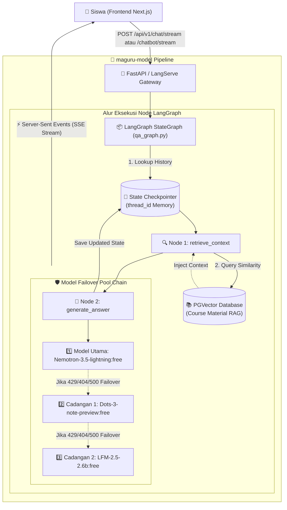

# 🤖 Maguru AI Co-Teacher Chatbot Architecture & Specification

Dokumen ini menjelaskan arsitektur teknis, alur data (*system flow*), spesifikasi skema, mekanisme ketahanan (*failover*), dan integrasi API untuk fitur **AI Co-Teacher Chatbot** pada platform Maguru.

---

## 1. 📌 Ikhtisar Fitur (Overview)

Fitur Chatbot di Maguru bukan sekadar percakapan umum (*generic chatbot*), melainkan bertindak sebagai **AI Co-Teacher yang sadar konteks pembelajaran (Context-Aware Learning Assistant)**.

### Karakteristik Utama:
1. **Multi-Turn State Persistence**: AI mengingat konteks percakapan sebelumnya dalam satu sesi menggunakan **LangGraph Checkpointer** berbasis `thread_id`.
2. **RAG-Powered (Retrieval-Augmented Generation)**: Jawaban AI diperkaya dengan materi kursus resmi yang tersimpan di Vector Store (PostgreSQL / Supabase pgvector) berdasarkan `course_id`.
3. **High Availability Multi-Model Pool**: Menjamin uptime dan menghindari kegagalan request saat model gratis OpenRouter mengalami *Rate Limit (429)* atau *Offline (404)* dengan failover otomatis (*pool failover*).
4. **Real-Time Token-by-Token SSE Streaming**: Memberikan pengalaman interaktif yang responsif dengan efek pengetikan langsung (*real-time typing effect*) di antarmuka siswa.

---

## 2. 🏛️ High-Level System Architecture



---

## 3. 🧩 Spesifikasi Parameter Input & Output

### A. Input Parameter (`ChatInputSchema`)
Seluruh parameter telah distandarisasi menggunakan Pydantic v2 yang kompatibel dengan JSON Schema Draft-07 (bebas dari issue render *blank screen*):

| Parameter | Tipe | Wajib/Opsional | Deskripsi |
| :--- | :--- | :--- | :--- |
| **`question`** | `string` | **Wajib** | Pertanyaan atau pesan yang diketik oleh siswa. |
| **`session_title`** | `string` | *Opsional* | Judul modul/bab materi yang sedang dibuka siswa (misal: *"Pengenalan Variabel"*). |
| **`session_content`** | `string` | *Opsional* | Cuplikan teks materi pembelajaran pada sesi aktif untuk konteks langsung. |
| **`course_id`** | `string` | *Opsional* | CUID / ID unik kursus untuk melakukan pencarian materi kursus di vector store via RAG. |
| **`thread_id`** | `string` | *Opsional* | ID unik sesi obrolan per user/per kursus untuk persistensi memori multi-turn. |

### B. Output Response (`ChatResponseSchema`)
```json
{
  "answer": "Halo! Python adalah bahasa pemrograman...",
  "thread_id": "session-user-123-course-456"
}
```

---

## 4. 🧠 Detail Implementasi Komponen Inti

### 1. LangGraph State & Node Pipeline ([`app/graphs/qa_graph.py`](file:///D:/.maguru/maguru-model/app/graphs/qa_graph.py))
- **`QAState`**:
  ```python
  class QAState(TypedDict):
      messages: Annotated[List[BaseMessage], operator.add]
      course_id: Optional[str]
      session_title: Optional[str]
      session_content: Optional[str]
      rag_context: Optional[str]
  ```
- **Node `retrieve_context`**: Mengambil materi kursus terkait menggunakan fungsi `get_course_context(course_id, query)`.
- **Node `generate_answer`**: Mengkonstruksi instruksi sistem ramah siswa (*Co-Teacher persona*) dan mengeksekusi LLM berantai.

### 2. Multi-Model Failover Pool ([`app/core/llm.py`](file:///D:/.maguru/maguru-model/app/core/llm.py))
- Memanfaatkan native LangChain `.with_fallbacks([llm_2, llm_3])`:
  ```python
  chained_llm = primary_llm.with_fallbacks(fallback_llms)
  ```
- Jika OpenRouter mengembalikan `429 (Rate Limit)` atau `404 (No endpoints found)`, request secara transparan langsung dialihkan ke model berikutnya dalam pool tanpa memunculkan error pada layar siswa.

### 3. Checkpointer Memory Provider ([`app/db/checkpointer.py`](file:///D:/.maguru/maguru-model/app/db/checkpointer.py))
- Menggunakan singleton pattern untuk mengelola persistensi memori percakapan.
- Menyediakan `InMemorySaver` untuk *development* cepat dan siap beralih ke `PostgresSaver` / `AsyncPostgresSaver` di lingkungan *production*.

---

## 5. 🌐 Kontrak API Endpoints

### 1. Real-Time Token Streaming (Disarankan untuk Frontend UI)
* **Endpoint**: `POST /api/v1/chat/stream` atau `POST /chatbot/stream`
* **Content-Type**: `text/event-stream`
* **Request Body**:
  ```json
  {
    "question": "Bagaimana cara kerja list comprehension?",
    "session_title": "List & Iterasi",
    "course_id": "cuid_python_101",
    "thread_id": "user_42_course_101"
  }
  ```
* **Format Response**: Token teks mengalir secara langsung (*Server-Sent Events*).

### 2. Synchronous Invocation (Untuk Request Tunggal / Non-Streaming)
* **Endpoint**: `POST /api/v1/chat` atau `POST /chatbot/invoke`
* **Content-Type**: `application/json`
* **Response**:
  ```json
  {
    "answer": "List comprehension di Python adalah cara ringkas untuk membuat list baru...",
    "thread_id": "user_42_course_101"
  }
  ```

### 3. Interactive Web Playground
* **URL**: `http://localhost:8000/chatbot/playground/`
* **Fungsi**: Antarmuka web interaktif bawaan LangServe untuk melakukan pengujian manual, validasi form input, dan monitoring token stream.

---

## 6. 🔌 Panduan Integrasi ke Frontend Next.js (`maguru`)

Pada aplikasi Next.js, komponen frontend dapat mengonsumsi stream SSE dengan fungsi `fetch` standar atau `EventSource`:

```typescript
// Contoh implementasi di Next.js Frontend (useChatbot.ts)
async function sendChatMessage(question: string, courseId: string, threadId: string) {
  const response = await fetch("http://localhost:8000/api/v1/chat/stream", {
    method: "POST",
    headers: { "Content-Type": "application/json" },
    body: JSON.stringify({
      question: question,
      course_id: courseId,
      thread_id: threadId
    })
  });

  const reader = response.body?.getReader();
  const decoder = new TextDecoder();
  let fullText = "";

  while (true) {
    const { value, done } = await reader!.read();
    if (done) break;
    const chunk = decoder.decode(value);
    fullText += chunk;
    // Update state React UI dengan token terbaru
    updateBotMessage(fullText);
  }
}
```

---

## 7. 🧪 Status Verifikasi & Pengujian

- **Unit & Architecture Tests**: 18/18 Tests **100% PASS** (`pytest tests/ -v`).
- **Live Model Response**: Terverifikasi berhasil merespons dalam Bahasa Indonesia yang edukatif dengan model pool aktif.
- **Failover Verification**: Terverifikasi menangani error 404/429 secara otomatis tanpa downtime.
