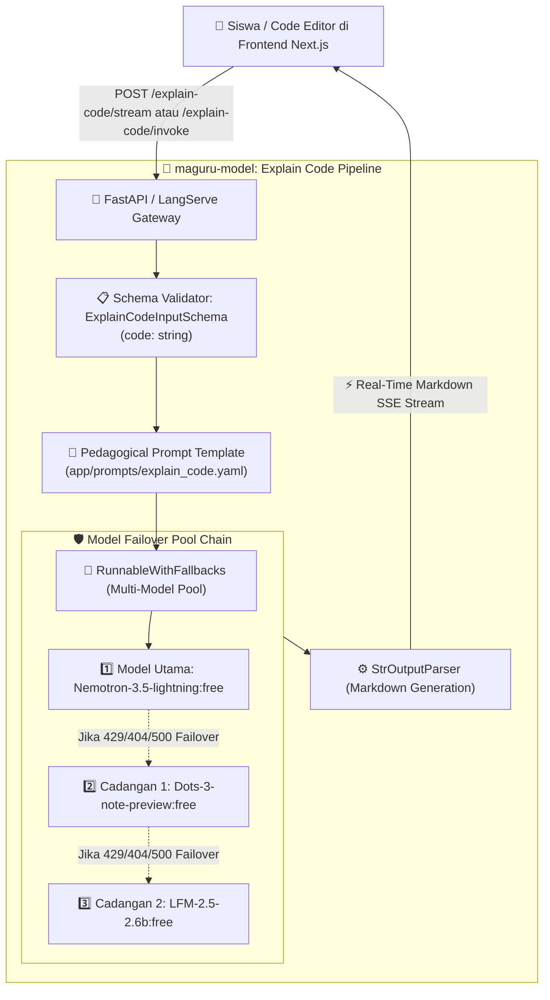

# 💻 Maguru AI Code Explainer (`explain-code`) Architecture & Specification

Dokumen ini menjelaskan arsitektur teknis, alur data (*system flow*), prinsip pedagogis, spesifikasi skema, dan panduan integrasi API untuk fitur **AI Code Explainer (`explain-code`)** pada platform Maguru.

---

## 1. 📌 Ikhtisar Fitur (Overview)

Fitur **Explain-Code** adalah modul penalaran AI (*AI Reasoning Engine*) di Maguru yang dirancang khusus untuk membedah dan menjelaskan potongan kode pemrograman (khususnya Python) dengan gaya bahasa yang ramah, visual, dan mudah dipahami oleh pemula maupun anak-anak (*Pedagogical Code Explanation*).

### Karakteristik Utama:
1. **4-Tier Pedagogical Structure**:
   - **Line-by-Line Breakdown**: Penjelasan setiap baris kode dengan analogi visual (contoh: variabel sebagai "kotak penyimpan").
   - **Mental Model & Logic**: Menjelaskan *mengapa* sintaks bekerja seperti itu (contoh: perbedaan operator assignment `=` vs persamaan matematika).
   - **Common Pitfalls & Anti-Patterns**: Mengidentifikasi kesalahan umum yang sering dialami pemula (case sensitivity, tipe data string vs integer, indentasi).
   - **Supportive Encouragement**: Kata-kata penyemangat untuk membangun kepercayaan diri siswa.
2. **High-Speed Deterministic Pipeline**: Dijalankan secara stateless dan teroptimasi menggunakan LCEL (*LangChain Expression Language*).
3. **High Availability Failover Pool**: Resilient terhadap rate-limit OpenRouter dengan failover otomatis ke beberapa model cadangan.
4. **Interactive Playground Ready**: Dilengkapi skema input Pydantic standar untuk memudahkan pengujian di browser.

---

## 2. 🏛️ High-Level System Architecture



---

## 3. 🧩 Spesifikasi Skema Input & Output

### A. Skema Input (`ExplainCodeInputSchema`)
Didefinisikan di [`app/schemas/chat.py`](file:///D:/.maguru/maguru-model/app/schemas/chat.py):

| Field | Tipe | Wajib | Deskripsi |
| :--- | :--- | :--- | :--- |
| **`code`** | `string` | **Wajib** | Potongan kode Python/pemrograman yang ingin diminta penjelasannya oleh siswa. |

```json
{
  "code": "nama = input('Masukkan nama kamu: ')\nprint(f'Halo, {nama}!')"
}
```

### B. Output Response
Menghasilkan teks berformat Markdown lengkap dengan heading, bold formatting, dan bullet points:

```markdown
Hai! Selamat datang di kelas Python. Yuk, pelajari setiap barisnya dengan bahasa sederhana:

### 1. Apa yang dilakukan setiap baris?
**Baris 1:** `nama = input(...)`
- Program menunggu input dari keyboard dan menyimpannya di variabel `nama`.
...
```

---

## 4. 🧠 Detail Komponen & Implementasi

### 1. Chain Definition ([`app/chains/explain_code.py`](file:///D:/.maguru/maguru-model/app/chains/explain_code.py))
```python
def create_explain_code_chain():
    """Create LangServe-compatible chain with explicit input schema."""
    def invoke(input_data: Any) -> str:
        if isinstance(input_data, dict):
            code = input_data.get("code") or input_data.get("code_snippet") or ""
        else:
            code = getattr(input_data, "code", "")
        return explain_code(code_snippet=code)
    return RunnableLambda(invoke).with_types(input_type=ExplainCodeInputSchema)
```

### 2. Prompt Pedagogis ([`app/prompts/explain_code.yaml`](file:///D:/.maguru/maguru-model/app/prompts/explain_code.yaml))
Prompt dirancang khusus untuk memandu LLM agar:
- Menggunakan Bahasa Indonesia santun, bersahabat, dan edukatif.
- Menghindari jargon teknis berlebihan tanpa penjelasan analogi.
- Membagi penjelasan ke dalam 4 bagian standar (Baris per baris, Cara kerja, Kesalahan umum, dan Motivasi).

### 3. Failover Pool Integration ([`app/core/llm.py`](file:///D:/.maguru/maguru-model/app/core/llm.py))
- Menggunakan `get_llm()` yang otomatis membungkus model utama dengan daftar cadangan:
  `primary.with_fallbacks([fallback_1, fallback_2])`.

---

## 5. 🌐 Kontrak API Endpoints

### 1. Real-Time Streaming Endpoint (Direkomendasikan untuk Frontend)
* **Endpoint**: `POST /explain-code/stream`
* **Content-Type**: `text/event-stream`
* **Request Body**:
  ```json
  {
    "code": "angka1 = 10\nangka2 = 5\nhasil = angka1 + angka2\nprint(hasil)"
  }
  ```
* **Response**: Aliran token Markdown Server-Sent Events (SSE).

### 2. Synchronous Invocation Endpoint
* **Endpoint**: `POST /explain-code/invoke`
* **Content-Type**: `application/json`
* **Response**:
  ```json
  {
    "output": "Hai! Selamat datang di kelas Python..."
  }
  ```

### 3. Web Playground
* **URL**: `http://localhost:8000/explain-code/playground/`
* **Fungsi**: Uji coba interaktif dengan form input textarea khusus kode di browser.

---

## 6. 🔌 Panduan Integrasi ke Frontend Next.js (`maguru`)

Komponen Monaco Code Editor atau editor latihan siswa di Next.js dapat menambahkan tombol *"Jelaskan Kode Ini"* dengan memanggil fungsi fetch stream:

```typescript
// Contoh integrasi di features/code-editor/hooks/useExplainCode.ts
export async function explainSelectedCode(codeSnippet: string, onToken: (token: string) => void) {
  const response = await fetch("http://localhost:8000/explain-code/stream", {
    method: "POST",
    headers: { "Content-Type": "application/json" },
    body: JSON.stringify({ code: codeSnippet })
  });

  const reader = response.body?.getReader();
  const decoder = new TextDecoder();

  while (true) {
    const { value, done } = await reader!.read();
    if (done) break;
    const chunk = decoder.decode(value);
    onToken(chunk);
  }
}
```

---

## 7. 🧪 Status Verifikasi & Pengujian

- **Unit Tests**: Lulus pengujian unit parsing dan sanitasi di `tests/test_app_architecture.py`.
- **Live Output Quality**: Menghasilkan ~1.800 token penjelasan terstruktur dengan format Markdown rapi dan akurat pada tes live.
- **Failover Compatibility**: Teruji berjalan mulus tanpa crash layar putih pada LangServe Playground.
