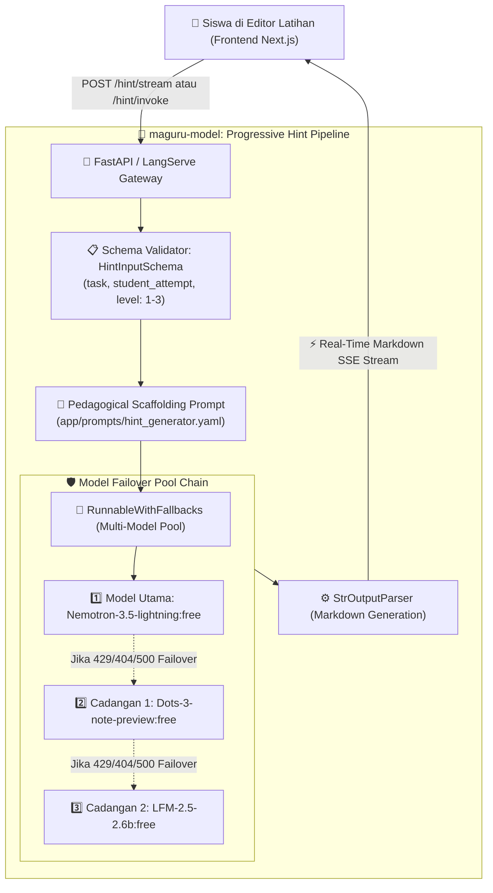

# 💡 Maguru AI Progressive Hint Generator (`hint`) Architecture & Specification

Dokumen ini menjelaskan arsitektur teknis, alur data (*system flow*), filosofi *Progressive Scaffolding Hint*, spesifikasi skema, dan panduan integrasi API untuk fitur **AI Hint Generator (`hint`)** pada platform Maguru.

---

## 1. 📌 Ikhtisar Fitur (Overview)

Fitur **Hint Generator** adalah modul asistensi adaptif di Maguru yang dirancang untuk membantu siswa ketika mengalami kebuntuan (*stuck*) dalam mengerjakan tugas atau latihan pemrograman Python tanpa langsung memberikan jawaban jadi (*no spoon-feeding*).

### Filosofi Pedagogis (*Scaffolding Model*):
Sistem membagi petunjuk ke dalam **3 Tingkat Ketajaman (Progressive Levels)**:
1. **Level 1 (Subtle / Konseptual)**:
   - Menyoroti konsep dasar atau fungsi yang relevan (misal: pentingnya konversi tipe data `int()`, penggunaan operator `%`).
   - Tidak membocorkan kode solusi penuh agar siswa terstimulasi untuk berpikir mandiri.
2. **Level 2 (Logic / Alur Logika)**:
   - Memberikan panduan alur logika percabangan/perulangan yang harus dibangun (misal: *"Jika `angka % 2 == 0` maka lakukan X, jika tidak lakukan Y"*).
3. **Level 3 (Concrete / Panduan Sintaks Spesifik)**:
   - Memberikan struktur sintaks yang hampir lengkap atau panduan perbaikan baris yang bermasalah secara langsung.

---

## 2. 🏛️ High-Level System Architecture



---

## 3. 🧩 Spesifikasi Skema Input & Output

### A. Skema Input (`HintInputSchema`)
Didefinisikan di [`app/schemas/chat.py`](file:///D:/.maguru/maguru-model/app/schemas/chat.py):

| Field | Tipe | Wajib/Opsional | Deskripsi |
| :--- | :--- | :--- | :--- |
| **`task`** | `string` | **Wajib** | Deskripsi soal atau instruksi tugas yang harus diselesaikan siswa. |
| **`student_attempt`** | `string` | *Opsional* | Potongan kode yang telah ditulis siswa saat ini (bisa kosong jika baru mulai). |
| **`level`** | `integer` | **Wajib** | Tingkat ketajaman petunjuk: `1` (Konseptual), `2` (Logika), atau `3` (Sintaks Detail). |

```json
{
  "task": "Buat program cek angka Genap atau Ganjil",
  "student_attempt": "angka = input('Masukkan angka: ')",
  "level": 1
}
```

### B. Output Response
Menghasilkan teks Markdown ramah siswa yang memicu pemecahan masalah:

```markdown
**Level 1 (Halus):**

Catatan: `input()` di Python mengembalikan nilai berupa teks (`string`), jadi kamu perlu mengubahnya menjadi bilangan bulat terlebih dahulu dengan `int()`. 

Untuk mengecek apakah angka genap atau ganjil, gunakan operator modulus `%`. Coba tulis `angka % 2`:
- Jika hasilnya `0`, berarti angka **genap**.
- Jika hasilnya `1` (atau tidak 0), berarti angka **ganjil**.

Coba perbaiki kodemu dengan menambahkan `int()` dan pengecekan `% 2`! 💡
```

---

## 4. 🧠 Detail Komponen & Implementasi

### 1. Chain Definition ([`app/chains/hint_generator.py`](file:///D:/.maguru/maguru-model/app/chains/hint_generator.py))
```python
def create_hint_generator_chain():
    """Create LangServe-compatible chain with explicit input schema."""
    def invoke(input_data: Any) -> str:
        if isinstance(input_data, dict):
            task = input_data.get("task", "")
            attempt = input_data.get("attempt") or input_data.get("student_attempt", "")
            level = input_data.get("level", 1)
        else:
            task = getattr(input_data, "task", "")
            attempt = getattr(input_data, "student_attempt", "")
            level = getattr(input_data, "level", 1)

        return generate_hint(task=task, student_attempt=attempt, level=int(level))
    return RunnableLambda(invoke).with_types(input_type=HintInputSchema)
```

### 2. Scaffolding Prompt Template ([`app/prompts/hint_generator.yaml`](file:///D:/.maguru/maguru-model/app/prompts/hint_generator.yaml))
- Memanfaatkan parameter `level` untuk mengatur batasan pemberian informasi (*information leakage control*).
- Mengharuskan AI menyertakan emoji penyemangat dan tone edukatif.

### 3. Failover Pool Multi-Model ([`app/core/llm.py`](file:///D:/.maguru/maguru-model/app/core/llm.py))
- Menggunakan `get_llm()` berantai (`primary.with_fallbacks([fallback_1, fallback_2])`).

---

## 5. 🌐 Kontrak API Endpoints

### 1. Real-Time Streaming Endpoint (Direkomendasikan untuk Frontend)
* **Endpoint**: `POST /hint/stream`
* **Content-Type**: `text/event-stream`
* **Request Body**:
  ```json
  {
    "task": "Hitung keliling persegi",
    "student_attempt": "sisi = input('Sisi: ')\nkeliling = sisi * 4",
    "level": 2
  }
  ```
* **Response**: Aliran token Server-Sent Events (SSE).

### 2. Synchronous Invocation Endpoint
* **Endpoint**: `POST /hint/invoke`
* **Content-Type**: `application/json`
* **Response**:
  ```json
  {
    "output": "**Level 2 (Logika):** Perhatikan perkalian tipe string..."
  }
  ```

### 3. Web Playground
* **URL**: `http://localhost:8000/hint/playground/`
* **Fungsi**: Uji coba interaktif pengisian form `task`, `student_attempt`, dan `level` di browser.

---

## 6. 🔌 Panduan Integrasi ke Frontend Next.js (`maguru`)

Di antarmuka latihan siswa, tombol petunjuk dapat dibuat bertingkat (misal: klik pertama memanggil Level 1, jika masih bingung klik lagi untuk meminta Level 2):

```typescript
// Contoh integrasi di features/exercises/hooks/useProgressiveHint.ts
export async function requestHint(
  taskDescription: string,
  currentCode: string,
  hintLevel: number,
  onToken: (token: string) => void
) {
  const response = await fetch("http://localhost:8000/hint/stream", {
    method: "POST",
    headers: { "Content-Type": "application/json" },
    body: JSON.stringify({
      task: taskDescription,
      student_attempt: currentCode,
      level: hintLevel
    })
  });

  const reader = response.body?.getReader();
  const decoder = new TextDecoder();

  while (true) {
    const { value, done } = await reader!.read();
    if (done) break;
    const chunk = decoder.decode(value);
    onToken(chunk);
  }
}
```

---

## 7. 🧪 Status Verifikasi & Pengujian

- **Unit Tests**: 100% Passed pada pengujian batas level (`1 <= level <= 3`) dan sanitasi input.
- **Live Output Quality**: Teruji pada pengujian live (Level 1 Genap/Ganjil) menghasilkan ~1.000 output tokens dengan bimbingan konseptual yang tepat tanpa membocorkan solusi akhir secara prematur.
- **Playground Form Input**: Form terverifikasi berfungsi normal tanpa issue layar putih.
