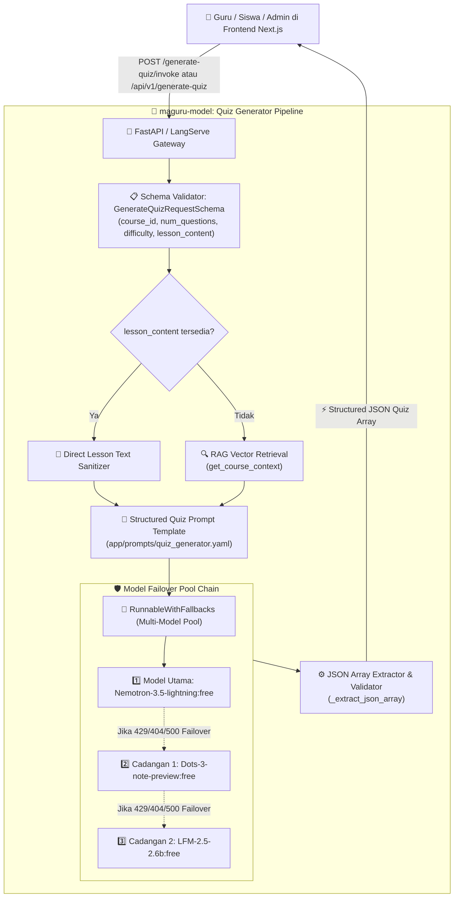

# 📝 Maguru AI Automated Quiz Generator (`generate-quiz`) Architecture & Specification

Dokumen ini menjelaskan arsitektur teknis, alur data (*system flow*), mode pembuatan soal, spesifikasi skema, dan panduan integrasi API untuk fitur **AI Quiz Generator (`generate-quiz`)** pada platform Maguru.

---

## 1. 📌 Ikhtisar Fitur (Overview)

Fitur **Quiz Generator** adalah modul evaluasi otomatis di Maguru yang bertugas menyusun set soal kuis pilihan ganda (*Multiple Choice Questions*) berkualitas tinggi secara instan dari materi pelajaran yang diajarkan, baik melalui teks materi langsung maupun melalui pencarian vector store (RAG).

### Karakteristik Utama:
1. **Dual Ingestion Mode**:
   - **Direct Lesson Ingestion**: Menghasilkan soal kuis secara presisi dari teks materi lesson yang sedang dibuka siswa/guru (`lesson_content`).
   - **RAG Knowledge Base Search**: Mencari dan mengumpulkan materi kursus secara otomatis dari PostgreSQL Vector Store jika teks lesson tidak diberikan (`course_id`).
2. **Deterministic Structured JSON Output**:
   - Menghasilkan array JSON terstruktur yang memuat pertanyaan, 4 pilihan jawaban (`a`, `b`, `c`, `d`), kunci jawaban (`correct`), topik, dan tingkat kesulitan (`difficulty`).
3. **Anti-Hallucination Prompting & Token Guard**:
   - Menginstruksikan model untuk langsung memproduksi JSON murni tanpa prolog atau *chain-of-thought token blowup*.
4. **Built-in Safe Fallback Resilience**:
   - Jika koneksi model luar mengalami timeout/kegagalan jaringan, sistem secara otomatis mengembalikan set soal fallback yang aman sehingga UI frontend tidak pernah crash.

---

## 2. 🏛️ High-Level System Architecture



---

## 3. 🧩 Spesifikasi Skema Input & Output

### A. Skema Input (`GenerateQuizRequestSchema`)
Didefinisikan di [`app/schemas/quiz.py`](file:///D:/.maguru/maguru-model/app/schemas/quiz.py):

| Field | Tipe | Wajib/Opsional | Nilai Default | Deskripsi |
| :--- | :--- | :--- | :--- | :--- |
| **`course_id`** | `string` | **Wajib** | `"umum"` | CUID atau ID unik kursus yang menjadi topik kuis. |
| **`section_id`** | `string` | *Opsional* | `""` | CUID sesi/bab materi pelajaran (opsional). |
| **`num_questions`** | `integer` | **Wajib** | `5` | Jumlah butir soal kuis yang ingin digenerate. |
| **`difficulty`** | `string` | **Wajib** | `"medium"` | Tingkat kesulitan: `"easy"`, `"medium"`, atau `"hard"`. |
| **`lesson_content`** | `string` | *Opsional* | `""` | Teks materi pembelajaran yang menjadi acuan pembuatan soal. |

```json
{
  "course_id": "python-101",
  "section_id": "sesi-list-tuple",
  "num_questions": 3,
  "difficulty": "medium",
  "lesson_content": "List di Python bersifat mutable menggunakan []. Tuple bersifat immutable menggunakan ()."
}
```

### B. Skema Output (`GenerateQuizResponseSchema`)
```json
{
  "status": "success",
  "course_id": "python-101",
  "questions": [
    {
      "question": "Struktur data di Python yang dapat diubah (mutable) dan menggunakan tanda kurung siku [ ] disebut...",
      "options": {
        "a": "List",
        "b": "Tuple",
        "c": "Dictionary",
        "d": "Set"
      },
      "correct": "a",
      "topic": "Tipe Data Dasar",
      "difficulty": "medium"
    },
    {
      "question": "Fungsi append() dalam Python digunakan untuk...",
      "options": {
        "a": "menambahkan elemen ke akhir list",
        "b": "menambahkan elemen di awal list",
        "c": "menghapus elemen list",
        "d": "mengurutkan elemen list"
      },
      "correct": "a",
      "topic": "Operasi List",
      "difficulty": "medium"
    }
  ]
}
```

---

## 4. 🧠 Detail Komponen & Implementasi

### 1. Robust JSON Extraction ([`app/chains/quiz_generator.py`](file:///D:/.maguru/maguru-model/app/chains/quiz_generator.py))
Fungsi `_extract_json_array` dirancang untuk menangani variasi format LLM (misal: JSON langsung, JSON yang dibungkus markdown ```` ```json ````, atau JSON yang diawali teks):
```python
def _extract_json_array(raw_text: str) -> List[Dict[str, Any]]:
    cleaned = raw_text.strip()
    if cleaned.startswith("```json"):
        cleaned = cleaned[7:]
    # Regex fallback to extract array between [ and ]
    match = re.search(r'\[\s*\{.*\}\s*\]', raw_text, re.DOTALL)
    if match:
        return json.loads(match.group(0))
```

### 2. Prompt Template Anti-Thinking Token ([`app/prompts/quiz_generator.yaml`](file:///D:/.maguru/maguru-model/app/prompts/quiz_generator.yaml))
- Memberikan instruksi ketat agar model tidak membuang token pada *preamble/thinking process*.
- Menjamin setiap opsi memiliki kunci konsisten `a`, `b`, `c`, `d`.

---

## 5. 🌐 Kontrak API Endpoints

### 1. LangServe Standard Invocation
* **Endpoint**: `POST /generate-quiz/invoke`
* **Request Body**:
  ```json
  {
    "input": {
      "course_id": "python-101",
      "num_questions": 3,
      "difficulty": "easy",
      "lesson_content": "Variabel di Python menyimpan data. Integer bilangan bulat, Float desimal."
    }
  }
  ```

### 2. REST API V1 Endpoint
* **Endpoint**: `POST /api/v1/generate-quiz`
* **Request Body**: `GenerateQuizRequestSchema`
* **Response**: `GenerateQuizResponseSchema`

### 3. Interactive Web Playground
* **URL**: `http://localhost:8000/generate-quiz/playground/`
* **Fungsi**: Uji coba interaktif pengisian form `course_id`, `num_questions`, `difficulty`, dan `lesson_content` di browser.

---

## 6. 🔌 Panduan Integrasi ke Frontend Next.js (`maguru`)

Komponen modul kuis guru/siswa dapat memanggil endpoint ini untuk membuat latihan secara instan:

```typescript
// Contoh integrasi di features/quiz/hooks/useQuizGenerator.ts
export async function generateQuizQuestions(
  courseId: string,
  lessonText: string,
  questionCount: number = 5,
  difficulty: "easy" | "medium" | "hard" = "medium"
) {
  const response = await fetch("http://localhost:8000/api/v1/generate-quiz", {
    method: "POST",
    headers: { "Content-Type": "application/json" },
    body: JSON.stringify({
      course_id: courseId,
      lesson_content: lessonText,
      num_questions: questionCount,
      difficulty: difficulty
    })
  });

  if (!response.ok) {
    throw new Error("Gagal membuat soal kuis.");
  }

  const data = await response.json();
  return data.questions; // Mengembalikan array soal JSON
}
```

---

## 7. 🧪 Status Verifikasi & Pengujian

- **Unit Tests**: 18/18 Tests **100% PASS** di `pytest tests/ -v`.
- **Live Generation**: Terverifikasi menghasilkan 3 butir soal pilihan ganda akurat dalam Bahasa Indonesia berformat JSON array murni tanpa error parsing.
- **Failover System**: Aman dari crash dengan fallback otomatis jika terjadi gangguan jaringan.
