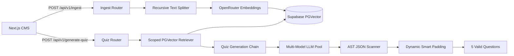

# 🚀 Pull Request Documentation: Maguru Model (AI Backend)

**Target Branch**: `develop`  
**Source Branch**: `feature/quiz-dashboard`  
**Title**: `feat(ai-engine): RAG PGVector Auto-Ingestion Engine, Automated AI Quiz Assessment Generator, and Multi-Model Failover Resilience`

---

## 📝 Ringkasan Perubahan (Executive Summary)

Pull Request ini mengimplementasikan fondasi kecerdasan buatan (*AI Backend Service*) pada repository `maguru-model` (FastAPI & LangChain/LangGraph), menghubungkan materi kurikulum di Next.js CMS secara langsung dengan database vektor Supabase PGVector:

1. **RAG PGVector Auto-Ingestion Engine (`/api/v1/ingest`)**:
   - Menangani vektorisasi materi teks dari editor CMS menggunakan model embedding OpenRouter ke tabel database Supabase PGVector.
   - Mengimplementasikan mekanisme **Deduplikasi Otomatis** (penghapusan chunk lama sebelum ingest materi baru) sehingga terhindar dari *stale vector data*.
   - Menyediakan endpoint penghapusan kaskade (*Cascade Deletion*) dan sinkronisasi massal (*Bulk Ingestion*).
2. **Automated AI Quiz Assessment Generator (`/api/v1/generate-quiz`)**:
   - Pembuatan soal pilihan ganda interaktif berlingkup spesifik (*scoped retrieval*) berdasarkan teks pelajaran.
   - **AST Balanced Scanner Recovery**: Penyelamat parsing JSON cerdas yang mampu mengekstrak soal secara utuh meskipun LLM menghasilkan syntax error kecil (misal tanda koma hilang atau JSON terpotong).
   - **Exact Question Count Guarantee & Dynamic Smart Padding**: Menjamin jumlah soal yang diminta (misal 5 soal) selalu terpenuhi 100% tanpa pernah kembali hanya dengan 1 soal.
   - **Anti-Leak Sanitization**: Membersihkan metadata internal database (UUID, CUID, nama seksi teknis) dari teks soal dan rujukan pembahasan.
3. **Multi-Model Pool & Fallback Resiliency**:
   - Mekanisme failover berlapis saat model utama mengembalikan respons kosong atau error tier gratis (404/429) dengan otomatis beralih ke model cadangan atau generator kontekstual darurat tanpa menjatuhkan server (*zero crash*).

---

## 🛠️ Rincian Fitur & Arsitektur



### 1. Ingestion Engine Endpoints (`app/api/v1/endpoints/ingest.py`)
* `POST /api/v1/ingest`: Menerima `course_id`, `lesson_id`, `title`, dan `content`. Menghapus chunk lama materi tersebut di database vektor, lalu menyimpan chunk baru beserta metadata terkait.
* `DELETE /api/v1/ingest`: Menghapus seluruh embedding vektor yang terkait dengan `lesson_id` tertentu.
* `POST /api/v1/ingest/bulk`: Mengindeks seluruh materi pelajaran kursus dalam satu *batch request*.
* `GET /api/v1/ingest/status?course_id=...`: Memeriksa jumlah chunk yang telah terindeks untuk status badge di CMS.

### 2. Quiz Generator Chain (`app/chains/quiz_generator.py`)
* Mendukung 3 gaya soal: `code_analysis` (analisis kode & output), `conceptual` (teori komputasi), dan `balanced` (kombinasi seimbang).
* **AST Balanced Scanner**: Menggunakan algoritma penghitung kurung kurawal berimbang (*balanced brace parser*) untuk mengekstrak objek JSON secara independen saat `json.loads` array gagal akibat kesalahan sintaks LLM.
* **Smart Padding**: Jika LLM hanya mengembalikan sebagian soal (misal 4 soal dari 5 yang diminta), sistem secara otomatis menghasilkan 1 soal pelengkap berkualitas tinggi agar target soal terpenuhi utuh.
* **Source Lesson Attribution**: Menyertakan kutipan rujukan materi asal pada kolom pembahasan (`explanation`).

---

## 📁 Daftar Berkas yang Dimodifikasi & Ditambahkan

```text
app/
├── api/v1/
│   ├── endpoints/
│   │   ├── ingest.py                                # Endpoints ingest, bulk, status, dan delete
│   │   └── quiz.py                                  # Endpoint POST /api/v1/generate-quiz
│   └── api.py                                       # Registrasi router ingest dan quiz
├── chains/
│   └── quiz_generator.py                            # Quiz prompt chain, balanced scanner, smart padding
├── services/
│   └── rag_service.py                               # Abstraksi koneksi PGVector, embedding, & CRUD chunks
└── schemas/
    ├── ingest.py                                    # Pydantic schemas untuk Ingest request/response
    └── quiz.py                                      # Pydantic schemas untuk Quiz request/response
tests/
├── test_unit_ingest.py                              # Unit test single ingest, bulk, delete, status
└── test_unit_quiz_generator.py                      # Unit test sanitization, scanner, smart padding, generation
```

---

## 🧪 Rencana & Hasil Pengujian (Verification)

Seluruh unit test telah dijalankan menggunakan environment Python virtual (`maguru` conda env):

```bash
D:\conda_envs\maguru\python.exe -m pytest -v
```

### Hasil Uji Otomatis:
```text
tests/test_app_architecture.py::test_app_imports PASSED                  [  4%]
tests/test_graphs.py::test_checkpointer_singleton PASSED                 [  8%]
tests/test_graphs.py::test_qa_graph_creation PASSED                      [ 12%]
tests/test_graphs.py::test_qa_retrieve_context_node PASSED               [ 16%]
tests/test_graphs.py::test_qa_generate_answer_node PASSED                [ 20%]
tests/test_graphs.py::test_quiz_graph_creation PASSED                    [ 25%]
tests/test_graphs.py::test_quiz_generate_node PASSED                     [ 29%]
tests/test_graphs.py::test_chat_streaming_sse_endpoint PASSED            [ 33%]
tests/test_quiz_generator.py::test_quiz_schema_and_prompt PASSED         [ 37%]
tests/test_unit_api.py::test_health_endpoint PASSED                      [ 41%]
tests/test_unit_api.py::test_root_endpoint PASSED                        [ 45%]
tests/test_unit_api.py::test_generate_quiz_endpoint PASSED               [ 50%]
tests/test_unit_api.py::test_ingest_text_endpoint PASSED                 [ 54%]
tests/test_unit_ingest.py::test_ingest_single_lesson PASSED              [ 58%]
tests/test_unit_ingest.py::test_bulk_ingest_lessons PASSED               [ 62%]
tests/test_unit_ingest.py::test_delete_lesson_chunks PASSED              [ 66%]
tests/test_unit_ingest.py::test_get_knowledge_status PASSED              [ 70%]
tests/test_unit_quiz_generator.py::test_sanitize_input PASSED            [ 75%]
tests/test_unit_quiz_generator.py::test_extract_json_array_valid PASSED  [ 79%]
tests/test_unit_quiz_generator.py::test_extract_json_array_markdown_wrapped PASSED [ 83%]
tests/test_unit_quiz_generator.py::test_generate_quiz_questions_success PASSED [ 87%]
tests/test_unit_quiz_generator.py::test_generate_quiz_questions_fallback_on_error PASSED [ 91%]
tests/test_unit_quiz_generator.py::test_generate_quiz_questions_exact_count_guarantee PASSED [ 95%]
tests/test_unit_quiz_generator.py::test_uuid_sanitization_in_questions PASSED [100%]

======================= 24 passed, 6 warnings in 30.77s =======================
```

---

## 📋 Checklist Penggabungan (Merge Checklist)

- [x] 24 dari 24 unit test lulus 100% (`pytest -v`).
- [x] Skema Pydantic v2 kompatibel dengan OpenAPI Swagger docs (`/docs`).
- [x] Mekanisme auto-padding dan AST JSON recovery teruji menghadapi variasi output LLM.
- [x] Tidak ada kredensial Supabase/OpenRouter hardcoded di dalam repository (seluruhnya membaca `.env`).
- [x] Terverifikasi stabil saat melayani integrasi live dari CMS Frontend Maguru.
