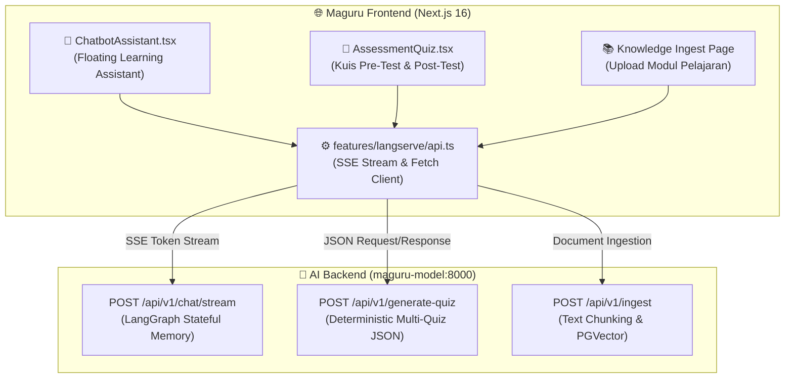

Viewed 2026-07-27-sprint-2-user-story-4-rag-plan.md:1-150
Viewed 2026-07-27-sprint-2-user-story-4-rag-plan.md:151-300
Ran command: `Get-ChildItem -Path "d:\.maguru\maguru\features" -Directory | Select-Object Name`

Melihat struktur fitur di `maguru`...

Edited error.md
Ran command: `Get-ChildItem -Path "d:\.maguru\maguru\features\langserve" -Recurse | Select-Object FullName`

Melihat detail `features/langserve` di `maguru`...

Berdasarkan analisis mendalam terhadap dokumen rencana [**`docs/plans/2026-07-27-sprint-2-user-story-4-rag-plan.md`**](file:///d:/.maguru/maguru/docs/plans/2026-07-27-sprint-2-user-story-4-rag-plan.md), berikut adalah **hasil evaluasi status, pemetaan kebutuhan, dan brainstorming alur integrasi ke Frontend Next.js**:

---

## 📊 1. Evaluasi Status User Story (Sprint 2 US 4)

| User Story | Deskripsi Fitur | Status di `maguru-model` (Backend AI) | Status di `maguru` (Frontend Next.js) |
| :--- | :--- | :--- | :--- |
| **US 4.1** | **RAG Infrastructure Setup** | ✅ **100% Selesai** (PGVector Supabase, embeddings, fallback pool) | ✅ Terhubung ke Supabase DB |
| **US 4.2** | **Lesson Content Auto-Ingestion** | ✅ **100% Selesai** (`POST /api/v1/ingest` & `POST /admin/ingest`) | ⏳ **Perlu Dihubungkan** (Halaman Admin/Creator Ingest) |
| **US 4.3** | **Automated Quiz Generation** | ✅ **100% Selesai** (`POST /api/v1/generate-quiz`, multi-quiz JSON) | ⏳ **Perlu Dihubungkan** (Assessment Engine di Next.js) |
| **US 4.4** | **AI Chat Interface & Streaming** | ✅ **100% Selesai** (`POST /api/v1/chat/stream` & `/chatbot/stream`) | ⏳ **Perlu Dihubungkan** (`ChatbotAssistant.tsx` & `api.ts`) |

> **Kesimpulan:** Seluruh fondasi **Phase 1 (Backend AI Engine)** telah **100% selesai dan terverifikasi**. Langkah kita selanjutnya adalah mengeksekusi **Phase 2 (Frontend Client Integration di Next.js)**.

---

## 🧠 2. Brainstorming Arsitektur Integrasi Frontend ↔ Backend

Berikut adalah alur komunikasi yang akan menghubungkan komponen UI Next.js dengan server AI Python:

---

## 🎯 3. Rekomendasi Urutan Pengerjaan (Step-by-Step Action Plan)

Untuk menjaga pengerjaan tetap rapi dan terukur, kita bagi ke dalam 3 milestone:

### 🔹 Milestone 1: AI Chatbot Interface (US 4.4) — *Prioritas Utama*
1. **Konfigurasi Environment**:
   * Memastikan `NEXT_PUBLIC_LANGSERVE_URL=http://localhost:8000` ada di `.env.local` Next.js.
2. **API Fetcher Stream ([`features/langserve/api.ts`](file:///d:/.maguru/maguru/features/langserve/api.ts))**:
   * Menulis helper reader stream menggunakan `fetch` + `ReadableStreamDefaultReader` untuk mengonsumsi token SSE dari `/api/v1/chat/stream`.
3. **UI Integration ([`ChatbotAssistant.tsx`](file:///d:/.maguru/maguru/features/langserve/chatbot/ChatbotAssistant.tsx))**:
   * Menghubungkan state chat (input teks, loading typing indicator, autoscroll pesan, rendering Markdown).
   * Menghubungkan parameter konteks (`course_id`, `session_title`, `thread_id`).

### 🔹 Milestone 2: Automated Quiz Assessment Generator (US 4.3)
1. **Menghubungkan Assessment Engine di Next.js**:
   * Menyambungkan tombol *"Buat Kuis Otomatis"* di dashboard guru/kursus ke endpoint `/api/v1/generate-quiz`.
   * Menampilkan hasil generate 5 soal ke UI preview kuis sebelum disimpan ke Supabase database.

### 🔹 Milestone 3: Auto-Ingestion Materi Kursus (US 4.2)
1. **Sinkronisasi Materi Pelajaran ke Vector Store**:
   * Ketika Creator/Admin menyimpan materi pelajaran baru di CMS Maguru, trigger otomatis memanggil `POST /api/v1/ingest` agar dokumen langsung terindeks di RAG vector store.

---

Bagaimana menurut Anda mengenai pemetaan dan urutan pengerjaan di atas? Jika Anda setuju, kita bisa mulai dari **Milestone 1: Menyambungkan API Streaming & UI Chatbot (`ChatbotAssistant.tsx`)**.