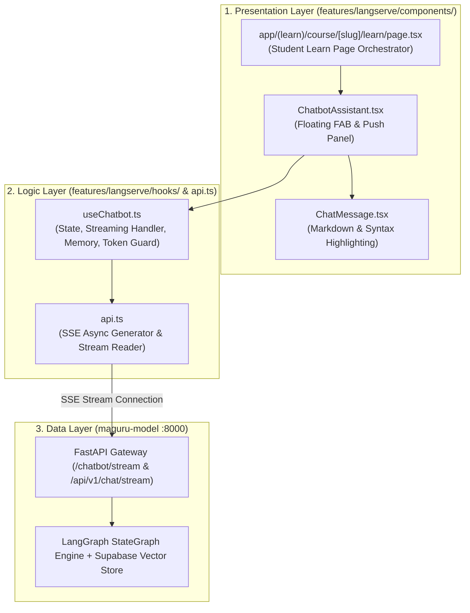

# 📋 Implementation Plan: AI Chatbot Co-Teacher Integration (Milestone 1)

**Document:** Implementation Plan & Technical Architecture Alignment  
**Standard:** Strictly adheres to [docs/rules/architecture.md](file:///d:/.maguru/maguru/docs/rules/architecture.md) (Modular Monolith 3-Tier Layer)  
**Target Feature:** `features/langserve/`  
**Target Page:** `app/(learn)/course/[slug]/learn/page.tsx` (Student Learning Classroom)  

---

## 1. 🎯 Overview & Goal

Milestone 1 bertujuan mengintegrasikan antarmuka **AI Co-Teacher Chatbot** pada Halaman Belajar Siswa (`/course/[slug]/learn`) dengan backend AI Python `maguru-model` (`http://localhost:8000`) menggunakan arsitektur **3-Tier Modular Monolith** sesuai aturan arsitektur Maguru.

### Fitur Utama:
1. **Real-time SSE Token Streaming**: AI membalas kata per kata secara langsung (*typing effect*).
2. **Context-Aware Assistance**: AI otomatis mengetahui konteks bab materi yang sedang dipelajari siswa (`session_title`, `session_content`, `course_id`).
3. **Multi-Turn Memory Persistence**: AI mengingat percakapan dalam satu sesi dengan `thread_id`.
4. **Resilient Failover**: Backend otomatis berpindah model jika terkena rate-limit tanpa membuat UI frontend crash.

---

## 2. 📐 Keselarasan Arsitektur 3-Tier (`docs/rules/architecture.md`)

Berdasarkan aturan arsitektur proyek, fitur diorganisir ke dalam 3 layer terisolasi:



---

## 3. 📂 Standarisasi Struktur Folder (`features/langserve/`)

Sesuai aturan `docs/rules/architecture.md`, struktur folder distandarisasi menjadi:

```text
features/langserve/
├── components/                 # 1. Presentation: UI Components
│   ├── ChatbotAssistant.tsx    # Floating Action Button & 400px Slide Panel
│   ├── ChatMessage.tsx         # Message Bubble & Markdown/Code Block
│   └── index.ts                # Component re-exports
│
├── hooks/                      # 2. Logic: Custom Hooks
│   ├── useChatbot.ts           # State management, SSE consumer, auto-scroll, abort controller
│   └── index.ts                # Hook re-exports
│
├── api.ts                      # 3. Logic/Data Client: Fetcher & SSE Stream Reader
├── types.ts                    # 4. TypeScript DTO & Context Interfaces
└── index.ts                    # 5. Public Feature Entrypoint
```

---

## 4. 🧩 Detail Peran Setiap Layer & Komponen

### A. Presentation Layer (`features/langserve/components/`)
* **`ChatbotAssistant.tsx`**:
  - Hanya bertugas me-render UI (FAB di pojok kanan bawah, Push-Layout Transition, input text box, tombol kirim, dan tombol hapus riwayat).
  - Mengonsumsi `useChatbot` hook tanpa menuliskan logic fetching/streaming secara inline.
  - Menerima `context` prop yang berisi `{ itemTitle, currentContent, courseId }`.
* **`ChatMessage.tsx`**:
  - Me-render bubble chat siswa (warna aksen) dan AI Co-Teacher (tema Ancient Fantasy Asia).
  - Memformat blok kode (*Syntax Highlighting*) dan Markdown.

### B. Logic Layer (`features/langserve/hooks/` & `api.ts`)
* **`useChatbot.ts`**:
  - Mengelola state: `messages`, `input`, `isStreaming`, `error`, dan `threadId`.
  - Mengontrol pengiriman pesan (`sendMessage`), pembatalan streaming (`stopStreaming`), dan pembersihan riwayat (`clearChat`).
  - Menangani sanitasi & pemotongan konten (*token truncation max 1000 karakter*) untuk efisiensi token model.
* **`api.ts`**:
  - Fungsi `streamChatbot(request, options)` yang melakukan `fetch()` dengan header `Accept: text/event-stream`.
  - Menggunakan `ReadableStreamDefaultReader` + async generator untuk mengurai chunk SSE `data: {"output": "chunk"}` secara real-time.

### C. Halaman Integrasi (`app/(learn)/course/[slug]/learn/page.tsx`)
* Memasang `<ChatbotAssistant />` di dalam `LearnPageInner` dengan meneruskan metadata pelajaran aktif dari `useLearnContext()`.

---

## 5. 📋 Step-by-Step Task Checklist

- [ ] **Task 1: Refaktor Struktur Folder `features/langserve/`**
  - Buat folder `features/langserve/hooks/` dan pindahkan komponen ke `features/langserve/components/`.
  - Buat file `features/langserve/types.ts` dan `features/langserve/index.ts` yang bersih.
- [ ] **Task 2: Buat Custom Hook `useChatbot.ts`**
  - Ekstrak seluruh business logic, state messages, streaming reader, dan auto-scroll dari `ChatbotAssistant.tsx` ke dalam `useChatbot.ts`.
- [ ] **Task 3: Refaktor `ChatbotAssistant.tsx` Menjadi Pure UI Component**
  - Hubungkan `ChatbotAssistant.tsx` langsung ke `useChatbot(context)`.
- [ ] **Task 4: Sinkronisasi API Client (`features/langserve/api.ts`)**
  - Pastikan endpoint `streamChatbot` mendukung `course_id` dan `thread_id` untuk memori percakapan.
- [ ] **Task 5: Pasang di Halaman Belajar Siswa (`app/(learn)/course/[slug]/learn/page.tsx`)**
  - Import dan render `<ChatbotAssistant context={{ itemTitle, currentContent, courseId }} />`.
- [ ] **Task 6: Manual Testing & Verifikasi Live Streaming**
  - Uji kirim pertanyaan di browser dan pastikan token AI mengalir lancar secara real-time.

---

## 6. 🧪 Kriteria Keberhasilan (Definition of Done)

1. **Architecture Compliance**: Struktur folder dan pemisahan Presentation ➔ Logic ➔ Data 100% sesuai `docs/rules/architecture.md`.
2. **Type Safety**: TypeScript bebas dari error linting dan tipe data `any`.
3. **Interactive Streaming**: Pengetikan respons AI mengalir lancar token-by-token di browser.
4. **Context-Aware**: AI mampu menjawab pertanyaan sesuai materi lesson yang sedang dibuka siswa.
