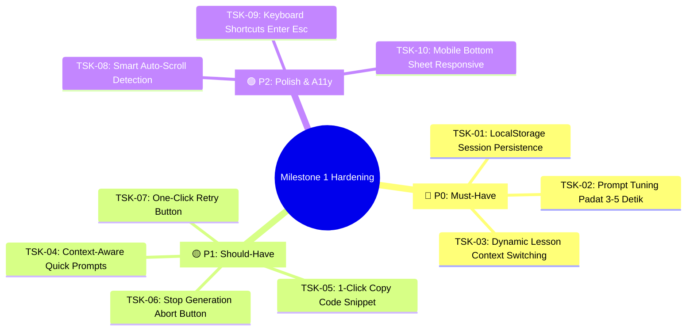

# 📋 Task Plan: AI Chatbot Assistant Hardening & Persistence (Milestone 1)

> **Feature Module**: `features/langserve/` & `app/(learn)/course/[slug]/learn/`  
> **Architecture Standard**: 3-Tier Modular Monolith (`Presentation` ➔ `Logic` ➔ `Data`)  
> **Status**: 🛠️ In-Progress Execution

---

## 🎯 1. Tujuan Utama (*Core Goals*)

Menyempurnakan fitur AI Chatbot Assistant (Milestone 1 / US 4.1) agar memiliki **persistensi riwayat percakapan di `localStorage`**, ketahanan navigasi antar-lesson (*context switching*), respon AI yang padat dan cepat (3–5 detik), serta fitur kenyamanan belajar tingkat lanjut (*Student UX Pro Max*).

---

## 🏗️ 2. Rincian Fitur Berdasarkan Prioritas



---

### 🔴 A. Must-Have Tasks (P0 - Kritikal)

#### 📌 TSK-01: LocalStorage Session Persistence per Course
* **Lokasi**: `features/langserve/chatbot/hooks/useChatbot.ts`
* **Spesifikasi**:
  * Simpan array `messages` dan `threadId` ke `localStorage` dengan key: `maguru_chat_session_${courseId}`.
  * Saat hook pertama kali di-mount, muat riwayat pesan dan `threadId` dari `localStorage` (dengan safe SSR hydration check).
  * Saat user mengklik tombol **Hapus Chat (Trash)**, hapus key dari `localStorage` dan buat `threadId` baru yang bersih.
* **Kriteria Keberhasilan**: Refresh halaman atau berpindah ke halaman lain dan kembali lagi tidak akan menghilangkan percakapan chat.

#### 📌 TSK-02: Prompt Tuning Jawaban Ringkas & Cepat (Anti-Potong)
* **Lokasi**: `D:\.maguru\maguru-model\app\prompts\qa_chatbot.yaml`
* **Spesifikasi**:
  * Tambahkan panduan: *"Berikan penjelasan yang ringkas, terstruktur (maksimal 2–3 paragraf), gunakan bullet point jika menjelaskan beberapa hal, dan sertakan blok kode singkat jika relevan."*
  * Batasi target token output agar selesai mengalir dalam waktu **3–6 detik**.
* **Kriteria Keberhasilan**: AI membalas cepat tanpa membuat teks 4.000 karakter yang rawan timeout atau terpotong di akhir.

#### 📌 TSK-03: Dynamic Lesson Context Switching & Visual Divider
* **Lokasi**: `features/langserve/chatbot/hooks/useChatbot.ts` & `ChatMessage.tsx`
* **Spesifikasi**:
  * Deteksi perubahan `context.itemTitle` saat siswa mengklik lesson baru di sidebar.
  * Jika ada percakapan aktif sebelumnya, sisipkan pesan pembatas visual sistem (*system separator*):  
    `📍 Beralih ke materi: [Judul Materi Baru]`
  * Perbarui konteks materi `session_title` dan `session_content` secara dinamis tanpa menghapus riwayat chat.

---

### 🟡 B. Should-Have Tasks (P1 - Pengalaman Pengguna Premium)

#### 📌 TSK-04: Context-Aware Quick Prompt Chips
* **Lokasi**: `features/langserve/chatbot/ChatbotAssistant.tsx`
* **Spesifikasi**:
  * Tampilkan 3 tombol saran cepat di atas input saat layar chat masih kosong:
    * 💡 *"Jelaskan konsep materi ini dengan analogi sederhana"*
    * 💻 *"Berikan contoh kode praktis untuk materi ini"*
    * ❓ *"Buat 1 kuis latihan singkat untuk menguji pemahaman saya"*
  * Klik pada chip otomatis mengirim prompt tersebut ke AI.

#### 📌 TSK-05: 1-Click Copy Code Snippet & Copy Message
* **Lokasi**: `features/langserve/chatbot/ChatMessage.tsx`
* **Spesifikasi**:
  * Tambahkan header mini pada setiap blok kode Markdown dengan tombol **"Salin Kode" (Copy)**.
  * Tampilkan feedback visual *"Tersalin! ✔️"* selama 2 detik saat tombol diklik.

#### 📌 TSK-06: Tombol Stop Streaming (AbortController)
* **Lokasi**: `features/langserve/chatbot/hooks/useChatbot.ts` & `ChatbotAssistant.tsx`
* **Spesifikasi**:
  * Saat `isStreaming: true`, ganti tombol Kirim menjadi tombol **"Stop" (Merah/Oranye)**.
  * Menggunakan `AbortController.abort()` untuk menghentikan pembacaan stream seketika.

#### 📌 TSK-07: One-Click Retry Button on Error Bubble
* **Lokasi**: `features/langserve/chatbot/ChatMessage.tsx` & `useChatbot.ts`
* **Spesifikasi**:
  * Jika pengiriman pesan gagal, sediakan tombol **"Coba Lagi" (Retry)** pada gelembung error.
  * Klik tombol retry akan otomatis mengirim ulang pertanyaan terakhir ke AI.

---

### 🟢 C. Polish & Accessibility Tasks (P2)

#### 📌 TSK-08: Smart Auto-Scroll Detection
* Pause auto-scroll jika siswa melakukan *scroll up* manual untuk membaca pesan di atasnya; resume auto-scroll saat siswa kembali ke posisi bawah.

#### 📌 TSK-09: Keyboard Shortcuts (Enter, Shift+Enter, Escape)
* `Enter` kirim pesan, `Shift + Enter` baris baru, `Escape` menutup panel chat.

#### 📌 TSK-10: Mobile Responsive Full Sheet
* Pada layar mobile (< 640px), panel chat otomatis menjadi *Full Height Drawer* yang nyaman digunakan di layar sentuh.

---

## 📊 Matriks Alur Pengerjaan:

```
[TSK-01: LocalStorage Persistence] ➔ [TSK-02: Prompt Tuning] ➔ [TSK-03: Lesson Context Switching]
       ↓
[TSK-04: Quick Prompts] ➔ [TSK-05: Copy Code] ➔ [TSK-06: Stop Stream] ➔ [TSK-07: Retry Button]
       ↓
[TSK-08 s/d TSK-10: Polish & Ergonomi] ➔ [Manual Test Checklist di report.md]
```