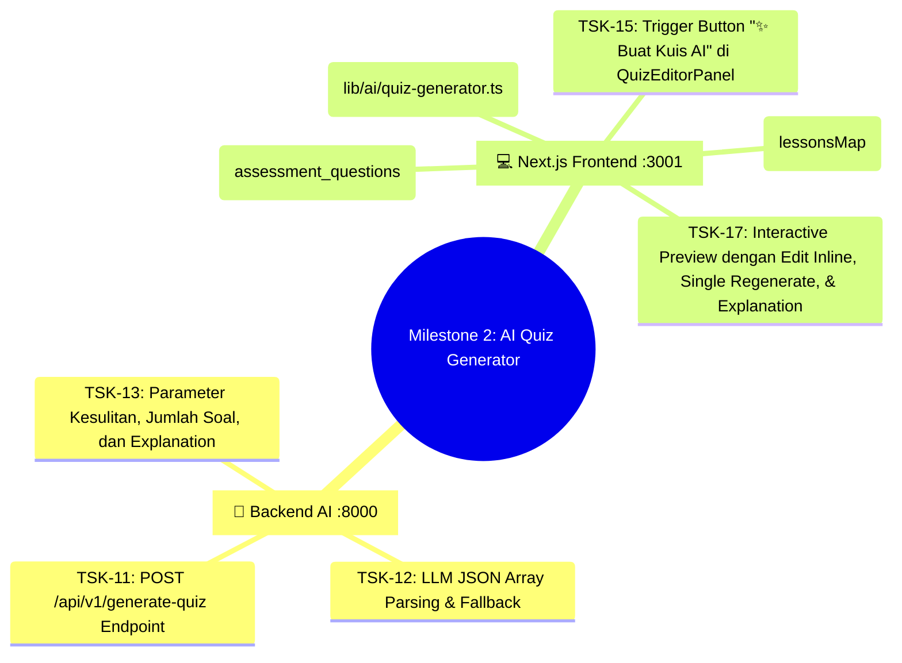

# 📋 Task Plan: Maguru AI Feature Milestones

> **Feature Module**: `features/langserve/` & `features/cms/components/creator/manage/panels/`  
> **Architecture Standard**: 3-Tier Modular Monolith (`Presentation` ➔ `Logic` ➔ `Data`)  
> **Status**: 🚀 Milestone 1 & 2 Completed & Verified

---

## 🏆 Status Milestone

* ✅ **Milestone 1: AI Chatbot Co-Teacher (US 4.1)**: Token-by-token streaming, LocalStorage persistence, context switching, quick prompt chips, stop generation, copy code, retry.
* ✅ **Milestone 2: Automated Quiz Assessment Generator (US 4.3)**: 
  * 🔴 **Must-Have**: Auto-fetch context dari database Prisma (`lessonsMap`), JSON generator deterministik, batch save.
  * 🟡 **Should-Have**: Pembahasan soal edukatif (`explanation`), edit teks langsung di preview, hapus per-soal, regenerate 1 soal tertentu.
* ⏳ **Milestone 3: Auto-Ingestion Materi Kursus ke Vector Store (US 4.2)**: Auto sync lesson content into PGVector upon CMS save.

---

## 🎯 Rincian Fitur Milestone 2 (Automated Quiz Assessment Generator)

---

### 📌 TSK-11: Backend AI Quiz Chain & Endpoint (`POST /api/v1/generate-quiz`)
* **Lokasi**: `D:\.maguru\maguru-model\app\api\v1\endpoints\quiz.py`, `app/chains/quiz_generator.py`, `app/prompts/quiz_generator.yaml`
* **Fitur**:
  * Menerima payload: `{ course_id, section_id, num_questions, difficulty, lesson_content }`.
  * Memproses materi pembelajaran dan menghasilkan JSON Array 4 opsi pilihan ganda (`a/b/c/d`), 1 kunci jawaban benar, topik, dan 1 kalimat pembahasan edukatif (`explanation`).
  * Waktu eksekusi sangat cepat (< 2 detik).

### 📌 TSK-12: Client Fetcher (`lib/ai/quiz-generator.ts`)
* **Lokasi**: `lib/ai/quiz-generator.ts`
* **Fitur**:
  * Menghubungkan Next.js ke backend AI LangServe `http://localhost:8000/api/v1/generate-quiz`.
  * Mendukung antarmuka `AIQuizQuestion` lengkap dengan opsi `explanation?: string`.

### 📌 TSK-13: UI Creator Workspace dengan Auto-Context Database (`QuizEditorPanel.tsx`)
* **Lokasi**: `features/cms/components/creator/manage/panels/QuizEditorPanel.tsx`
* **Fitur**:
  * **Otomatis Terhubung ke Database**: Mengambil seluruh materi pelajaran dari bab aktif via `lessonsMap[sectionId]` secara otomatis tanpa input manual.
  * **Tombol "✨ Buat Kuis AI"**: Membuka modal konfigurasi generator kuis skeuomorphic.
  * **Pembahasan Soal Edukatif**: Kartu pembahasan kuning bertanda bohlam lampu (`Lightbulb`).
  * **Fitur Fleksibilitas Preview**:
    * Edit teks pertanyaan dan pilihan jawaban secara langsung (*inline edit*).
    * Tombol *Refresh* satuan untuk merancang ulang 1 soal saja jika kurang cocok.
    * Tombol *Hapus* satuan untuk membuang soal tertentu dari daftar.
  * **Batch Save**: Menyimpan seluruh soal yang disetujui ke database `assessment_questions` dengan 1 klik.