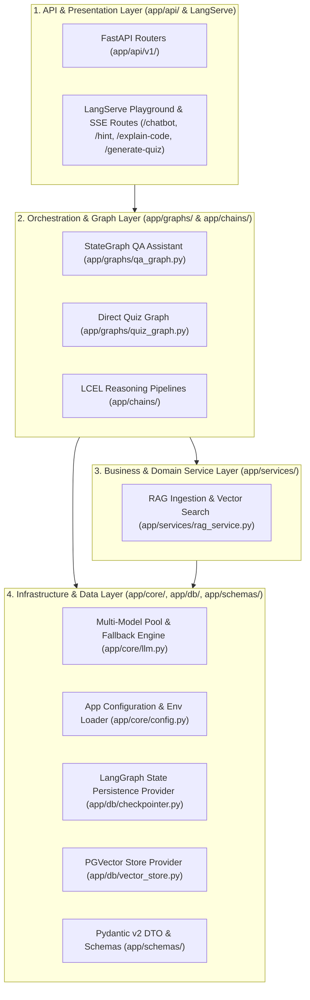
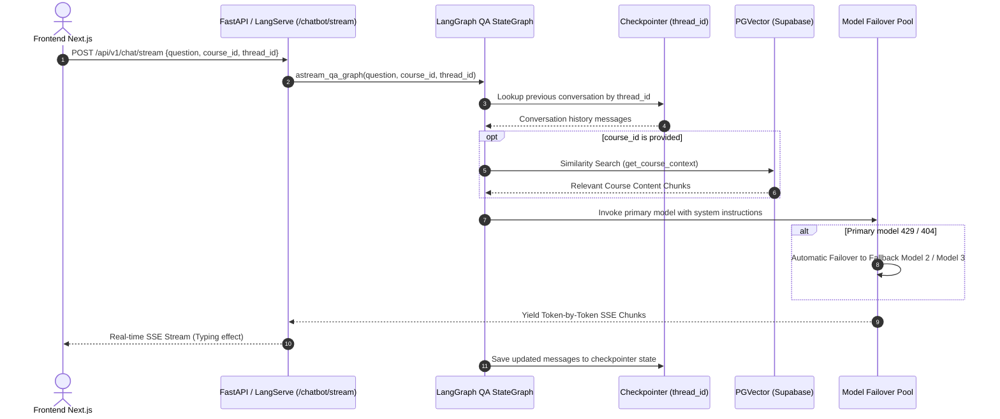
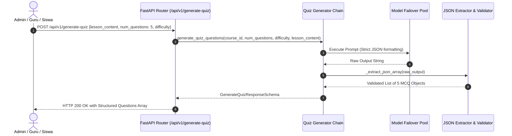

# 🏛️ Maguru AI Backend (`maguru-model`) Architecture Specification

**Author:** Technical Architecture Lead & AI Engineer  
**Status:** Approved Enterprise Architecture Specification  
**Version:** 2.0.0 (Enterprise LangGraph & Multi-Model Pool)

---

## 1. 📌 Executive Architecture Overview

`maguru-model` adalah backend microservice AI terdedikasi berbasis Python (FastAPI + LangChain / LangGraph / LangServe) yang menggerakkan seluruh kecerdasan buatan pada ekosistem platform **Maguru**, meliputi:

1. **Stateful AI Co-Teacher Chatbot (`app/graphs/qa_graph.py`)**: Asisten belajar interaktif dengan *multi-turn memory persistence* (`thread_id`) dan *RAG context enrichment* via Server-Sent Events (SSE) streaming.
2. **Pedagogical Code Explainer (`app/chains/explain_code.py`)**: Pembongkar potongan kode baris-per-baris dengan model mental dan pencegahan bug bagi pemula.
3. **Progressive Scaffolding Hint Generator (`app/chains/hint_generator.py`)**: Asisten latihan adaptif dengan 3 tingkat petunjuk bertingkat tanpa membocorkan solusi akhir (*anti-spoon feeding*).
4. **Automated Multi-Quiz Generator (`app/chains/quiz_generator.py` & `app/graphs/quiz_graph.py`)**: Generator kuis pilihan ganda otomatis dalam format JSON array terstruktur dari materi pelajaran.
5. **Multi-Model Failover Resilience Pool (`app/core/llm.py`)**: Ketahanan tinggi terhadap *Rate-Limit (429)* atau *Endpoint Offline (404)* menggunakan rantai fallback native LangChain.
6. **RAG Vector Knowledge Base (`app/services/rag_service.py` & `app/db/vector_store.py`)**: Ingestion dokumen dan similarity search menggunakan PostgreSQL `pgvector`.

---

## 2. 🧱 Clean Layered Architecture (N-Tier for AI Microservices)

Arsitektur `maguru-model` mengadopsi **Clean Modular Layering** yang memisahkan tanggung jawab sistem secara tegas:



---

## 3. 📂 Standard Directory Structure

```text
maguru-model/
├── app/                         # Core Application Package
│   ├── __init__.py
│   ├── main.py                  # FastAPI Application Factory & Lifespan Handler
│   │
│   ├── api/                     # REST API Routes & Endpoints
│   │   ├── __init__.py
│   │   ├── router.py            # Aggregated APIRouter
│   │   └── v1/
│   │       ├── __init__.py
│   │       ├── chat.py          # POST /api/v1/chat/stream & POST /api/v1/chat
│   │       ├── ingest.py        # POST /api/v1/ingest & POST /admin/ingest
│   │       ├── quiz.py          # POST /api/v1/generate-quiz
│   │       └── health.py        # GET /health & GET /
│   │
│   ├── core/                    # Core Infrastructure & LLM Singletons
│   │   ├── __init__.py
│   │   ├── config.py            # Pydantic Settings & model_pool property
│   │   ├── logging.py           # Structured Logging Setup
│   │   └── llm.py               # Multi-Model Pool Provider with with_fallbacks()
│   │
│   ├── db/                      # Persistence & Database Providers
│   │   ├── __init__.py
│   │   ├── checkpointer.py      # LangGraph Memory Persistence (InMemory / Postgres)
│   │   └── vector_store.py      # PGVector Provider (langchain-postgres)
│   │
│   ├── graphs/                  # Stateful LangGraph Workflows
│   │   ├── __init__.py          # Exports: run_qa_graph, astream_qa_graph, generate_quiz_direct
│   │   ├── qa_graph.py          # StateGraph Q&A Chatbot with thread_id persistence
│   │   └── quiz_graph.py        # StateGraph Quiz Assessment Generator
│   │
│   ├── chains/                  # Deterministic LCEL Reasoning Pipelines
│   │   ├── __init__.py
│   │   ├── qa_chatbot.py        # LangServe-compatible Q&A Chatbot wrapper
│   │   ├── explain_code.py      # Code Explainer Chain (.with_types)
│   │   ├── hint_generator.py    # 3-Tier Progressive Hint Chain (.with_types)
│   │   ├── quiz_generator.py    # Multi-Question Generator Chain (.with_types)
│   │   ├── quiz_feedback.py     # Student Quiz Feedback Evaluator (.with_types)
│   │   └── ai_greeting.py       # Personalized Student Greeting Chain (.with_types)
│   │
│   ├── prompts/                 # Externalized YAML Prompt Templates
│   │   ├── qa_chatbot.yaml
│   │   ├── explain_code.yaml
│   │   ├── hint_generator.yaml
│   │   ├── quiz_generator.yaml
│   │   ├── quiz_feedback.yaml
│   │   └── ai_greeting.yaml
│   │
│   ├── schemas/                 # Pydantic v2 Data Transfer Objects (DTO)
│   │   ├── __init__.py
│   │   ├── chat.py              # ChatInputSchema, ExplainCodeInputSchema, HintInputSchema, etc.
│   │   ├── quiz.py              # GenerateQuizRequestSchema, GenerateQuizResponseSchema
│   │   └── ingest.py            # IngestTextRequest, IngestResponse
│   │
│   └── services/                # Business Logic & Document Processing
│       ├── __init__.py
│       └── rag_service.py       # Document Chunking, Ingestion & Similarity Search
│
├── notebooks/                   # Jupyter Notebooks for AI Model Exploration
│   └── test_models.ipynb        # Real-time OpenRouter Free Models Benchmark & Tester
│
├── tests/                       # Automated Test Suite (18 Tests, 100% Pass)
│   ├── conftest.py              # Pytest Fixtures & Mocks
│   ├── test_app_architecture.py # Module Imports & Architecture Verification
│   ├── test_graphs.py           # LangGraph State & Checkpointer Unit Tests
│   ├── test_quiz_generator.py   # Quiz Schema & Prompt Unit Tests
│   ├── test_unit_api.py         # FastAPI Endpoints Integration Tests
│   └── test_unit_quiz_generator.py # JSON Parsing & Sanitization Tests
│
├── docs/                        # Technical Documentation
│   ├── architecture.md          # Comprehensive System Architecture (This File)
│   ├── architecture/            # Feature-Specific Architecture Documents
│   │   ├── chatbot.md           # AI Co-Teacher Architecture Specification
│   │   ├── explain-code.md      # Code Explainer Architecture Specification
│   │   ├── hint-generator.md    # Progressive Hint Architecture Specification
│   │   └── quiz-generator.md    # Quiz Generator Architecture Specification
│   └── SERVER_RUNNING_GUIDE.md  # Server Startup & Troubleshooting Guide
│
├── server.py                    # Root Entrypoint Wrapper (Imports app.main)
├── requirements.txt             # Python Dependencies (Modern & Non-deprecated)
├── environment.yml              # Conda Environment Specification
└── pytest.ini                   # Pytest Configuration
```

---

## 4. 🔄 System Data & Execution Flows

### Flow A: Stateful AI Co-Teacher Q&A Streaming (LangGraph + Memory)


### Flow B: Automated Multi-Quiz Generation (Direct Lesson / RAG)


---

## 5. 🛠️ Technology Stack & Package Versions

| Komponen | Library / Teknologi | Peran dalam Arsitektur |
| :--- | :--- | :--- |
| **API Gateway** | `FastAPI (>=0.110.0)`, `Uvicorn`, `sse-starlette` | Web framework, route dispatcher, Server-Sent Events |
| **Graph Orchestrator** | `langgraph (>=0.2.20)` | StateGraph workflows, multi-turn memory, cyclic graphs |
| **LangChain Ecosystem**| `langchain (>=0.3.0)`, `langchain-core`, `langserve` | Prompt management, LCEL, runnable interfaces |
| **Model Integration** | `langchain-openai (>=0.2.0)`, `openai (>=1.30.0)` | OpenRouter API client, model fallback chains |
| **Vector Database** | `langchain-postgres (>=0.0.12)`, `psycopg (>=3.1.18)` | Modern PostgreSQL pgvector vector store provider |
| **Data Validation** | `pydantic (>=2.6.0)`, `pydantic-settings` | DTO data validation, environment configuration |
| **Testing Suite** | `pytest (>=8.0.0)`, `pytest-asyncio`, `pytest-cov` | Automated unit, architecture, and integration tests |

---

## 6. 🛡️ High-Availability Failover Strategy

Model gratis OpenRouter dikonfigurasi dalam urutan prioritas di `.env`:
```env
OPENROUTER_MODEL_1=nvidia/nemotron-3.5-lightning:free
OPENROUTER_MODEL_2=dots-studio/dots-3-note-preview:free
OPENROUTER_MODEL_3=liquid/lfm-2.5-2.6b:free
```

* **Mekanisme Otomatis**:
  Setiap chain dan graph dibungkus dengan `primary_llm.with_fallbacks([fallback_1, fallback_2])`.
  Jika model utama mengalami *Rate-Limit (429)*, *Model Offline (404)*, atau *Server Error (500)*, sistem **secara instan mengalihkan eksekusi ke model cadangan berikutnya** tanpa interupsi pada sisi pengguna.

---

## 7. 🧪 Quality Assurance & Test Verification

Status suite pengujian saat ini:
- **18 dari 18 Test Suites PASSED (100% Green)**.
- Seluruh endpoint API, singleton checkpointer, node StateGraph, dan chain parser telah tervalidasi secara otomatis.
