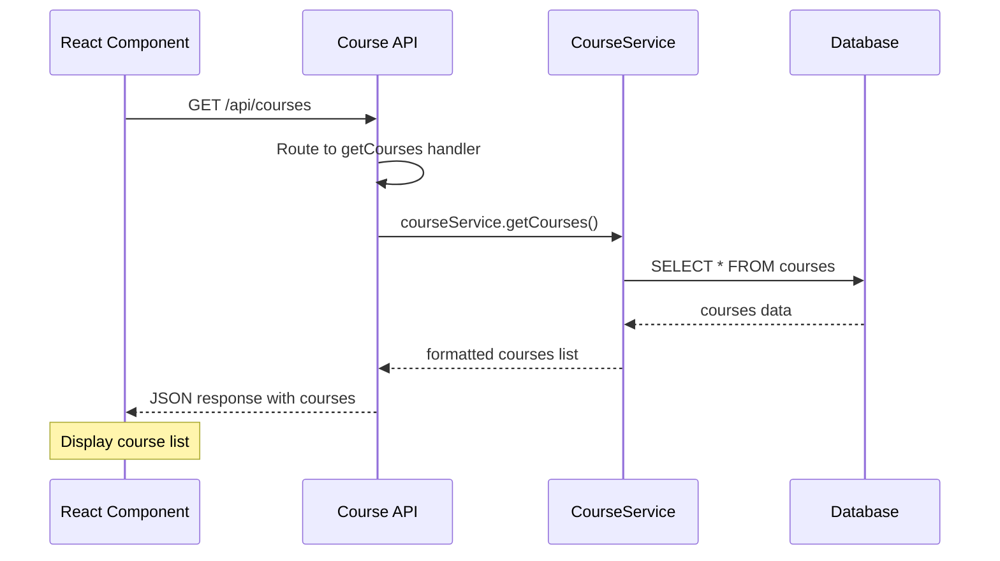
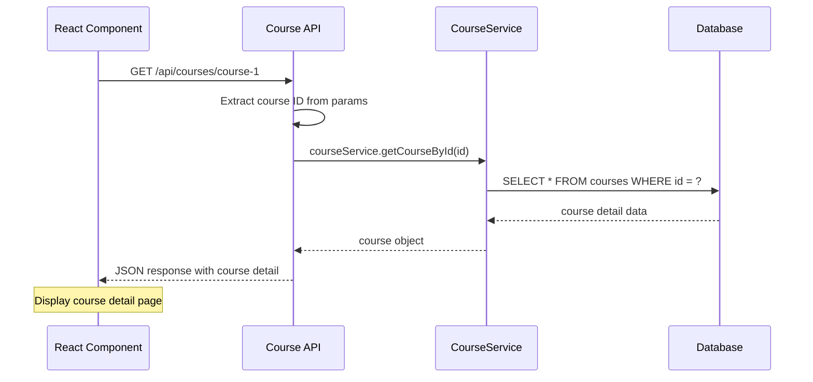
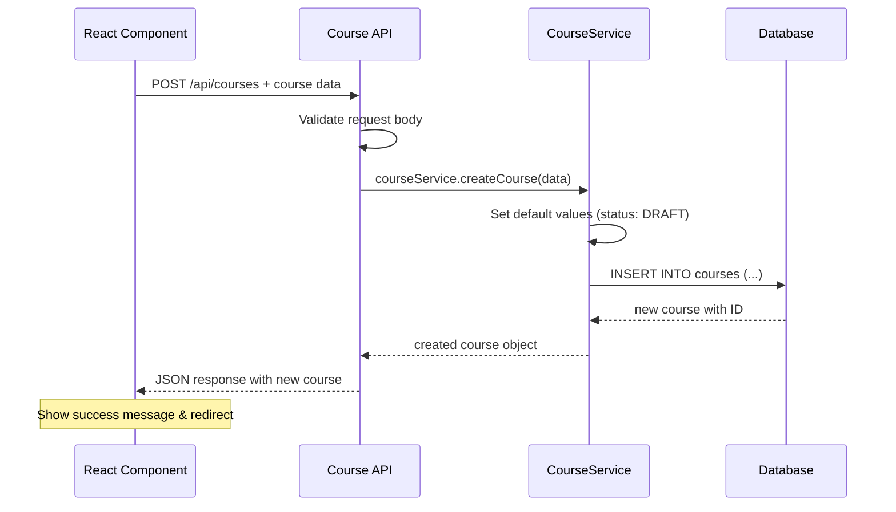
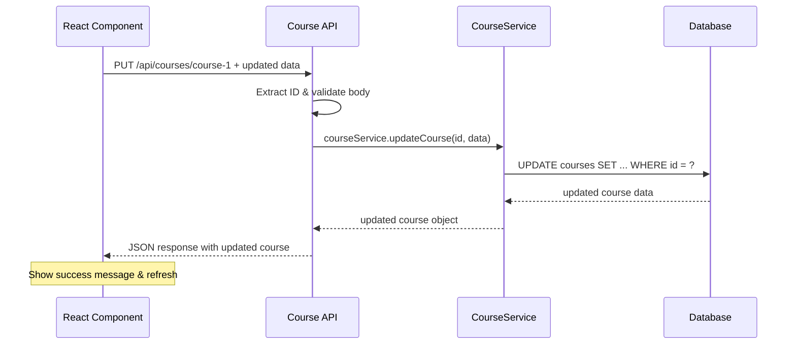
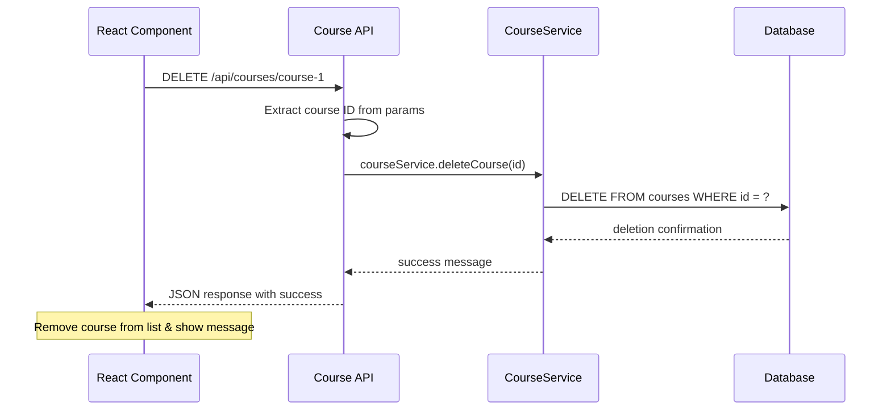

# Task #2: Model Arsitektur Komunikasi API Course

## Executive Summary

**Task Requirement:** _"Merancang model arsitektur komunikasi dan integrasi semua sistemnya"_

Dokumen ini menyajikan **model arsitektur komunikasi API Course** yang sederhana untuk mengintegrasikan sistem course dengan sistem lain melalui REST API.

**Fokus:**

- ✅ **API Course Communication** - REST API untuk CRUD operations
- ✅ **Simple Integration** - Komunikasi antar sistem melalui HTTP
- ✅ **Clear Documentation** - Penjelasan mudah dipahami untuk setiap endpoint

---

## 1. Current System Architecture

### **Existing Course System**

```
┌─────────────────────────────────────────────────┐
│               CURRENT SYSTEM                    │
├─────────────────────────────────────────────────┤
│ Frontend (React)                                │
│ ├── Course Management Pages                    │
│ ├── Course Catalog Pages                       │
│ └── Course Detail Pages                        │
├─────────────────────────────────────────────────┤
│ Backend (Next.js API)                          │
│ ├── CourseService - Business Logic             │
│ ├── Database Operations                        │
│ └── Authentication (Clerk)                     │
├─────────────────────────────────────────────────┤
│ Database (PostgreSQL)                          │
│ ├── courses table                              │
│ └── enrollments table                          │
└─────────────────────────────────────────────────┘
```

**Current Status:**

- ✅ Sistem course sudah berfungsi internal
- ✅ CRUD operations sudah lengkap
- ⚠️ Belum bisa diakses sistem external

---

## 2. Proposed API Architecture for Integration

### **Simple Integration Architecture**

```
┌─────────────────┐    HTTP Request    ┌─────────────────┐    Internal Call    ┌─────────────────┐
│ External System │ ────────────────→ │   Course API    │ ─────────────────→ │ CourseService   │
│ (Payment,       │                   │ (/api/courses)  │                   │ (Business Logic)│
│  Certificate,   │ ←──────────────── │                 │ ←───────────────── │                 │
│  User Mgmt)     │    HTTP Response  │                 │    Data Response   │                 │
└─────────────────┘                   └─────────────────┘                   └─────────────────┘
                                              │
                                              ▼
                                      ┌─────────────────┐
                                      │    Database     │
                                      │   (PostgreSQL)  │
                                      │ ├── courses     │
                                      │ └── enrollments │
                                      └─────────────────┘
```

**Key Components:**

1. **External Systems** - Sistem lain yang butuh data course
2. **Course API** - REST API endpoints untuk komunikasi
3. **CourseService** - Business logic yang sudah ada
4. **Database** - Data storage yang sudah ada

---

## 3. API Course Communication Model

### **API Endpoint Structure**

```
Base URL: /api/courses

GET    /api/courses          - List all courses
GET    /api/courses/{id}     - Get specific course
POST   /api/courses          - Create new course
PUT    /api/courses/{id}     - Update course
DELETE /api/courses/{id}     - Delete course
```

---

## 4. Communication Flow Diagrams

### **GET /api/courses - List Courses Flow**



### **GET /api/courses/{id} - Get Course Detail Flow**



### **POST /api/courses - Create Course Flow**



### **PUT /api/courses/{id} - Update Course Flow**



### **DELETE /api/courses/{id} - Delete Course Flow**



---

## 5. API Documentation - CRUD Operations

### **GET /api/courses - List Courses**

**Purpose:** External system bisa mendapatkan daftar semua courses

**Request:**

```http
GET /api/courses
```

**Response:**

```json
{
  "success": true,
  "data": [
    {
      "id": "course-1",
      "title": "JavaScript Basic",
      "description": "Learn JavaScript from basic",
      "category": "programming",
      "status": "PUBLISHED",
      "students": 25,
      "createdAt": "2024-01-10",
      "creatorId": "user-123"
    }
  ]
}
```

**Integration Example:**

```javascript
// Payment System mengecek course yang tersedia
const courses = await fetch('/api/courses')
const data = await courses.json()
console.log('Available courses:', data.data)
```

---

### **GET /api/courses/{id} - Get Course Detail**

**Purpose:** External system bisa mendapatkan detail course tertentu

**Request:**

```http
GET /api/courses/course-1
```

**Response:**

```json
{
  "success": true,
  "data": {
    "id": "course-1",
    "title": "JavaScript Basic",
    "description": "Learn JavaScript from basic to advanced",
    "category": "programming",
    "status": "PUBLISHED",
    "students": 25,
    "lessons": 10,
    "duration": "5 jam",
    "rating": 4.5,
    "createdAt": "2024-01-10",
    "updatedAt": "2024-01-15",
    "creatorId": "user-123"
  }
}
```

**Integration Example:**

```javascript
// Certificate System mengecek detail course sebelum buat sertifikat
const courseDetail = await fetch('/api/courses/course-1')
const course = await courseDetail.json()
if (course.data.status === 'PUBLISHED') {
  console.log('Course valid untuk sertifikat:', course.data.title)
}
```

---

### **POST /api/courses - Create Course**

**Purpose:** External system bisa membuat course baru

**Request:**

```http
POST /api/courses
Content-Type: application/json

{
  "title": "Python Basic",
  "description": "Learn Python programming",
  "category": "programming"
}
```

**Response:**

```json
{
  "success": true,
  "data": {
    "id": "course-2",
    "title": "Python Basic",
    "description": "Learn Python programming",
    "category": "programming",
    "status": "DRAFT",
    "students": 0,
    "lessons": 0,
    "createdAt": "2024-01-20",
    "creatorId": "system-user"
  }
}
```

**Integration Example:**

```javascript
// Content Management System membuat course baru
const newCourse = await fetch('/api/courses', {
  method: 'POST',
  headers: { 'Content-Type': 'application/json' },
  body: JSON.stringify({
    title: 'New Course',
    description: 'Course description',
    category: 'programming',
  }),
})
const result = await newCourse.json()
console.log('Course created:', result.data.id)
```

---

### **PUT /api/courses/{id} - Update Course**

**Purpose:** External system bisa mengupdate data course

**Request:**

```http
PUT /api/courses/course-1
Content-Type: application/json

{
  "title": "JavaScript Advanced",
  "description": "Updated description",
  "category": "programming",
  "status": "PUBLISHED"
}
```

**Response:**

```json
{
  "success": true,
  "data": {
    "id": "course-1",
    "title": "JavaScript Advanced",
    "description": "Updated description",
    "category": "programming",
    "status": "PUBLISHED",
    "students": 25,
    "updatedAt": "2024-01-25",
    "creatorId": "user-123"
  }
}
```

**Integration Example:**

```javascript
// Analytics System mengupdate status course
const updateCourse = await fetch('/api/courses/course-1', {
  method: 'PUT',
  headers: { 'Content-Type': 'application/json' },
  body: JSON.stringify({
    title: 'Updated Course Title',
    status: 'PUBLISHED',
  }),
})
const updated = await updateCourse.json()
console.log('Course updated:', updated.data)
```

---

### **DELETE /api/courses/{id} - Delete Course**

**Purpose:** External system bisa menghapus course

**Request:**

```http
DELETE /api/courses/course-1
```

**Response:**

```json
{
  "success": true,
  "message": "Course deleted successfully",
  "data": {
    "id": "course-1",
    "deletedAt": "2024-01-25"
  }
}
```

**Integration Example:**

```javascript
// Admin System menghapus course
const deleteCourse = await fetch('/api/courses/course-1', {
  method: 'DELETE',
})
const result = await deleteCourse.json()
console.log('Course deleted:', result.message)
```

---

## 6. Integration Flow Examples

### **Payment System Integration**

```
1. User pilih course → Payment System call GET /api/courses/{id}
2. Validasi course ada dan PUBLISHED → Process payment
3. Payment success → Payment System call POST /api/enrollments
4. User dapat akses course
```

### **User Management Integration**

```
1. Admin buat course baru → User Management call POST /api/courses
```

---

## Conclusion

**Model Arsitektur Komunikasi API Course:**

🎯 **Simple REST API** - CRUD operations melalui HTTP endpoints yang mudah dipahami

🔗 **External Integration** - Sistem lain bisa akses course data melalui:

- **GET** untuk membaca data course
- **POST** untuk membuat course baru
- **PUT** untuk mengupdate course
- **DELETE** untuk menghapus course

📡 **Communication Flow** - HTTP Request/Response pattern yang standard dan mudah diimplementasi

**Implementation:** Menggunakan CourseService yang sudah ada + tambahan API routes untuk external access.

**Next Steps:**

1. Buat API routes sesuai struktur di atas
2. Test integration dengan sistem external
3. Add authentication untuk keamanan
