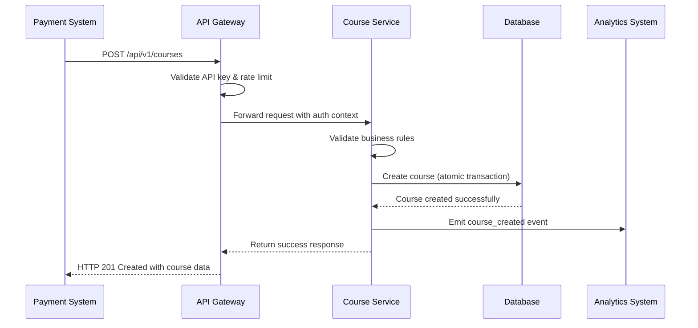
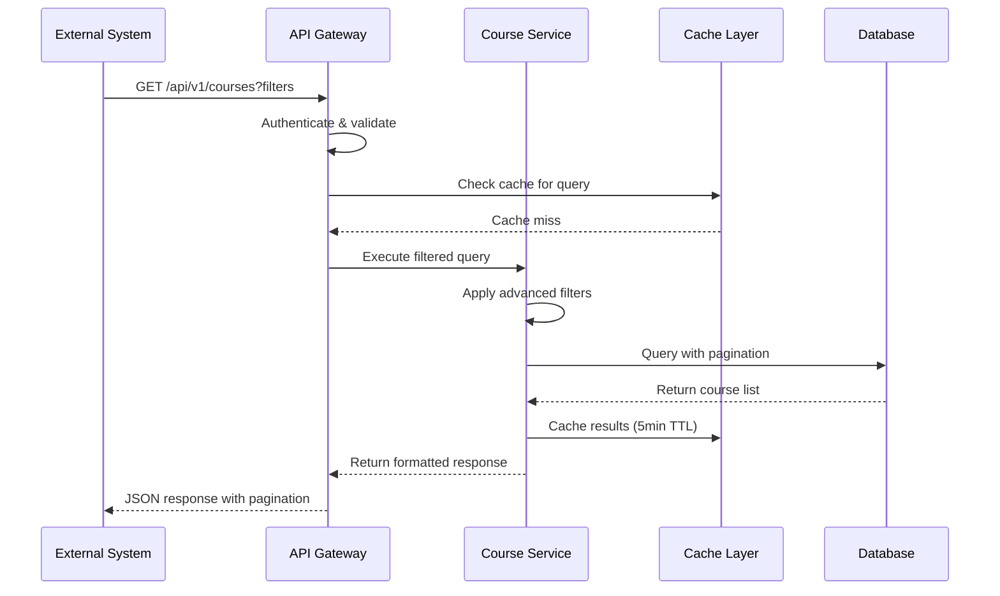
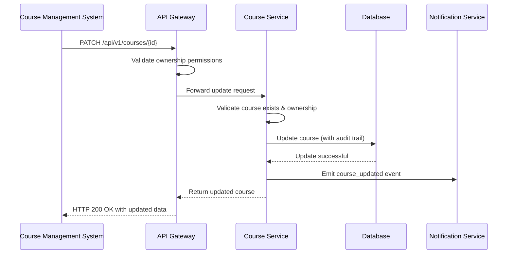
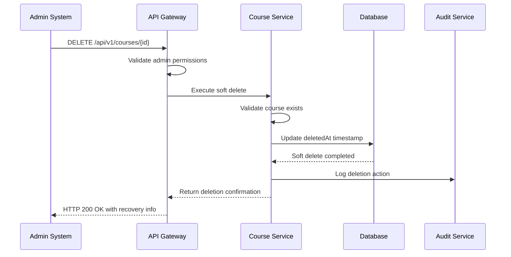

# Course System Architecture Model - Multi-System Integration Design

## Executive Summary
This document presents the **comprehensive architecture model** for transforming Maguru's current courseService into an **integration-ready system** that supports multi-system communication and integrasi for Task #2 requirements.

Based on deep analysis of `features/course/services`, this architecture model enables robust CRUD operations (Get Course, Post Course, Edit Course, Delete Course, Get Detail Course) with **data integrity focus** and **complete redesign approach**.

---

## Current System Architecture Analysis

### **Existing 3-Tier Architecture** 
```
┌─────────────────────────────────────────────────────────────────┐
│                     CURRENT MONOLITH                           │
├─────────────────────────────────────────────────────────────────┤
│ PRESENTATION LAYER                                              │
│ ├── Next.js App Router (/app/api/courses/*)                   │
│ ├── React Components (course-manage, course-catalog)          │
│ └── Custom Hooks (useCourse, useEnrollment)                   │
├─────────────────────────────────────────────────────────────────┤
│ BUSINESS LOGIC LAYER                                           │
│ ├── CourseService (CRUD, filtering, status management)        │
│ ├── EnrollmentService (atomic transactions, race conditions)  │
│ └── Client Adapters (courseAdapter, enrollmentAdapter)        │  
├─────────────────────────────────────────────────────────────────┤
│ DATA ACCESS LAYER                                              │
│ ├── Prisma ORM (transaction management)                       │
│ ├── PostgreSQL Database (courses, enrollments)               │
│ └── Supabase Storage (thumbnails, media files)               │
└─────────────────────────────────────────────────────────────────┘
```

### **Current Integration Capabilities**
✅ **Strengths:**
- **Service Layer Pattern**: Clean separation dengan business logic di CourseService/EnrollmentService
- **Transaction Management**: Atomic operations dengan Prisma $transaction
- **Type Safety**: Comprehensive TypeScript interfaces + Zod validation
- **Error Handling**: Robust error scenarios (race conditions, concurrent access, connection failures)
- **Authentication Ready**: Clerk integration dengan creatorId-based ownership

⚠️ **Limitations for Multi-System Integration:**
- **Monolithic Deployment**: Single Next.js application, not service-oriented
- **Internal Communication**: Direct function calls, not network-based APIs
- **Hard Delete**: No soft delete for data recovery
- **No External APIs**: Missing external-facing API contracts
- **No Event System**: No webhooks/events for external system notifications

---

## Multi-System Integration Architecture Model

### **Proposed Architecture: Service-Oriented with API Gateway**

```
┌─────────────────────────────────────────────────────────────────────────────────┐
│                              MULTI-SYSTEM ECOSYSTEM                            │
├─────────────────────────────────────────────────────────────────────────────────┤
│  External Systems        │    API Gateway    │      Course System              │
│                         │                   │                                  │
│ ┌─────────────────────┐ │ ┌───────────────┐ │ ┌──────────────────────────────┐ │
│ │ Payment System      │─┼→│ Authentication│ │ │ ┌──────────────────────────┐ │ │
│ │ - Course pricing    │ │ │ Rate Limiting │ │ │ │    Course API v1         │ │ │
│ │ - Enrollment fees   │ │ │ Request Routing│ │ │ │  /api/v1/courses/*      │ │ │
│ │                     │ │ │ Error Handling │ │ │ └──────────────────────────┘ │ │
│ └─────────────────────┘ │ │               │ │ │ ┌──────────────────────────┐ │ │
│                         │ │               │ │ │ │    CourseService         │ │ │
│ ┌─────────────────────┐ │ │               │ │ │ │  - CRUD operations       │ │ │
│ │ Certificate System  │─┼→│               │ │ │ │  - Soft delete logic     │ │ │
│ │ - Course completion │ │ │               │ │ │ │  - Advanced filtering    │ │ │
│ │ - Achievement mgmt  │ │ │               │ │ │ │  - Status management     │ │ │
│ │                     │ │ │               │ │ │ └──────────────────────────┘ │ │
│ └─────────────────────┘ │ │               │ │ │ ┌──────────────────────────┐ │ │
│                         │ │               │ │ │ │  EnrollmentService       │ │ │
│ ┌─────────────────────┐ │ │               │ │ │ │  - Atomic transactions   │ │ │
│ │ User Management     │─┼→│               │ │ │ │  - Enrollment validation │ │ │
│ │ - User profiles     │ │ │               │ │ │ │  - Race condition mgmt   │ │ │
│ │ - Authentication    │ │ │               │ │ │ └──────────────────────────┘ │ │
│ │ - Authorization     │ │ │               │ │ │ ┌──────────────────────────┐ │ │
│ └─────────────────────┘ │ │               │ │ │ │    Database Layer        │ │ │
│                         │ │               │ │ │ │  - PostgreSQL (courses)  │ │ │
│ ┌─────────────────────┐ │ │               │ │ │ │  - Soft delete support   │ │ │
│ │ Analytics Platform  │─┼→│               │ │ │ │  - Audit trail logging   │ │ │
│ │ - Usage metrics     │ │ │               │ │ │ │  - Transaction integrity │ │ │
│ │ - Performance data  │ │ │               │ │ │ └──────────────────────────┘ │ │
│ │ - Business insights │ │ └───────────────┘ │ └──────────────────────────────┘ │
│ └─────────────────────┘ │                   │                                  │
└─────────────────────────────────────────────────────────────────────────────────┘
```

### **Communication Flow Patterns**

#### **1. Course Creation Flow (POST Course)**


#### **2. Course Query Flow (GET Courses)**


#### **3. Course Update Flow (PUT/PATCH Course)**


#### **4. Soft Delete Flow (DELETE Course)**


---

## Integration Architecture Components

### **1. API Gateway Layer**
```typescript
interface APIGatewayConfig {
  // Authentication & Authorization
  authentication: {
    strategies: ['jwt', 'api-key', 'oauth2']
    rateLimiting: {
      anonymous: '60/minute'
      authenticated: '200/minute'
      premium: '500/minute'
    }
  }
  
  // Request Routing
  routing: {
    versioning: 'url-path' // /api/v1/courses
    loadBalancing: 'round-robin'
    retryPolicy: {
      maxRetries: 3
      backoffStrategy: 'exponential'
    }
  }
  
  // Response Transformation
  transformation: {
    errorStandardization: true
    responseCompression: true
    fieldFiltering: true
  }
}
```

### **2. Enhanced Course Service Architecture**
```typescript
// Enhanced CourseService dengan multi-system support
export class CourseServiceV2 extends CourseService {
  // Existing methods enhanced
  async createCourse(
    data: CreateCourseRequest, 
    creatorId: string,
    context: IntegrationContext
  ): Promise<CourseResponse> {
    // 1. Enhanced validation dengan external system rules
    await this.validateWithExternalSystems(data, context)
    
    // 2. Create dengan soft delete support
    const course = await this.createWithAuditTrail(data, creatorId)
    
    // 3. Emit events untuk external systems
    await this.emitCourseCreatedEvent(course, context)
    
    return { success: true, data: course }
  }
  
  // New integration methods
  async createCourseForExternalSystem(
    data: ExternalCourseRequest,
    systemId: string
  ): Promise<CourseResponse> {
    // Handle external system-specific logic
  }
  
  async syncCourseWithExternalSystem(
    courseId: string,
    systemId: string,
    syncData: SyncRequest
  ): Promise<SyncResponse> {
    // Bi-directional sync logic
  }
  
  // Soft delete implementation
  async softDeleteCourse(
    id: string, 
    creatorId: string,
    reason?: string
  ): Promise<CourseResponse> {
    const course = await this.validateOwnership(id, creatorId)
    
    const deletedCourse = await prisma.course.update({
      where: { id },
      data: {
        status: CourseStatus.DELETED,
        deletedAt: new Date(),
        deletionReason: reason
      }
    })
    
    // Emit deletion event for external systems
    await this.emitCourseDeletionEvent(deletedCourse)
    
    return { success: true, data: deletedCourse }
  }
  
  // Recovery method
  async restoreDeletedCourse(
    id: string,
    creatorId: string
  ): Promise<CourseResponse> {
    const course = await prisma.course.update({
      where: { 
        id, 
        creatorId,
        status: CourseStatus.DELETED 
      },
      data: {
        status: CourseStatus.DRAFT,
        deletedAt: null,
        deletionReason: null
      }
    })
    
    await this.emitCourseRestoredEvent(course)
    
    return { success: true, data: course }
  }
}
```

### **3. Event-Driven Communication**
```typescript
interface CourseEventSystem {
  // Course lifecycle events
  events: {
    'course.created': CourseCreatedEvent
    'course.updated': CourseUpdatedEvent  
    'course.deleted': CourseDeletedEvent
    'course.restored': CourseRestoredEvent
    'course.published': CoursePublishedEvent
    'course.enrolled': EnrollmentCreatedEvent
  }
  
  // External system subscriptions
  subscriptions: {
    paymentSystem: ['course.created', 'course.updated', 'course.deleted']
    certificateSystem: ['course.completed', 'course.published']
    analyticsSystem: ['*'] // All events
    notificationSystem: ['course.published', 'course.updated']
  }
}

// Event payloads
interface CourseCreatedEvent {
  eventId: string
  timestamp: Date
  courseId: string
  title: string
  creatorId: string
  category: string
  status: CourseStatus
  pricing?: {
    price: number
    currency: string
  }
}
```

### **4. Data Integrity & Recovery**
```typescript
interface DataIntegrityPattern {
  // Soft delete with audit trail
  softDelete: {
    implementation: 'timestamp-based' // deletedAt field
    recoveryPeriod: '30 days'
    auditLogging: true
    cascadePolicy: 'preserve-relationships'
  }
  
  // Transaction patterns
  atomicOperations: {
    enrollmentCreation: 'course.students increment + enrollment.create'
    statusUpdate: 'course.status update + audit_log.create + event.emit'
    bulkOperations: 'batch processing with rollback support'
  }
  
  // Data consistency
  consistencyChecks: {
    studentCountAccuracy: 'periodic reconciliation'
    orphanedEnrollments: 'cleanup job'
    cascadingDeletes: 'referential integrity validation'
  }
}
```

---

## Implementation Roadmap

### **Phase 1: API Gateway & Versioning (Week 1-2)**
```yaml
deliverables:
  - API Gateway setup dengan Next.js middleware
  - /api/v1/courses/* endpoint structure
  - Authentication & authorization layer
  - Rate limiting & request validation
  
technical_tasks:
  - Setup API versioning middleware
  - Implement API key authentication for external systems
  - Add request/response standardization
  - Setup comprehensive error handling
```

### **Phase 2: Service Enhancement (Week 2-3)**
```yaml
deliverables:
  - Enhanced CourseService dengan soft delete
  - Event system implementation
  - Advanced filtering & pagination
  - External system integration hooks
  
technical_tasks:
  - Database migration untuk soft delete fields
  - Event emission system setup
  - CourseService method enhancements
  - Integration testing framework
```

### **Phase 3: Multi-System Integration (Week 3-4)**
```yaml
deliverables:
  - External API contracts
  - Integration testing with mock systems
  - Documentation & examples
  - Performance optimization
  
technical_tasks:
  - Mock external system implementations
  - Integration test suite
  - Performance benchmarking
  - Documentation generation
```

---

## Technical Implementation Details

### **Database Schema Enhancements**
```sql
-- Enhanced Course table dengan soft delete
ALTER TABLE Course ADD COLUMN deletedAt TIMESTAMP NULL;
ALTER TABLE Course ADD COLUMN publishedAt TIMESTAMP NULL;
ALTER TABLE Course ADD COLUMN archivedAt TIMESTAMP NULL;
ALTER TABLE Course ADD COLUMN deletionReason TEXT NULL;

-- Add indexes untuk performance
CREATE INDEX idx_course_status_deleted ON Course(status, deletedAt);
CREATE INDEX idx_course_creator_status ON Course(creatorId, status);
CREATE INDEX idx_course_category_status ON Course(category, status) WHERE deletedAt IS NULL;

-- Audit trail table
CREATE TABLE CourseAuditLog (
  id UUID PRIMARY KEY DEFAULT gen_random_uuid(),
  courseId UUID REFERENCES Course(id),
  action VARCHAR(50) NOT NULL, -- 'created', 'updated', 'deleted', 'restored'
  changes JSONB,
  performedBy VARCHAR(255),
  performedAt TIMESTAMP DEFAULT NOW(),
  externalSystemId VARCHAR(100),
  context JSONB
);
```

### **API Contract Examples**
```typescript
// External system integration example
interface ExternalSystemIntegration {
  // Payment system integration
  paymentSystem: {
    validateCourseForPurchase: (courseId: string) => Promise<ValidationResult>
    notifyEnrollmentCreated: (enrollment: Enrollment) => Promise<void>
    syncCoursePrice: (courseId: string, price: number) => Promise<SyncResult>
  }
  
  // Certificate system integration  
  certificateSystem: {
    generateCertificate: (userId: string, courseId: string) => Promise<Certificate>
    validateCompletion: (enrollment: Enrollment) => Promise<CompletionStatus>
  }
  
  // Analytics system integration
  analyticsSystem: {
    trackCourseCreation: (course: Course) => Promise<void>
    trackEnrollment: (enrollment: Enrollment) => Promise<void>
    generateCourseMetrics: (courseId: string) => Promise<CourseMetrics>
  }
}
```

---

## Performance & Scalability Considerations

### **Caching Strategy**
```typescript
interface CacheConfiguration {
  courseList: {
    ttl: '5 minutes'
    keyPattern: 'courses:list:{filters_hash}'
    invalidation: ['course.created', 'course.updated', 'course.deleted']
  }
  courseDetail: {
    ttl: '15 minutes'
    keyPattern: 'course:detail:{id}'
    invalidation: ['course.updated', 'course.deleted', 'course.restored']
  }
  enrollmentCount: {
    ttl: '2 minutes'
    keyPattern: 'course:students:{id}'
    invalidation: ['enrollment.created', 'enrollment.deleted']
  }
}
```

### **Monitoring & Observability**
```typescript
interface MonitoringSetup {
  metrics: {
    apiLatency: 'P95 response time < 200ms'
    errorRate: 'Error rate < 1%'
    throughput: 'Support 1000 req/min per endpoint'
  }
  
  alerts: {
    highErrorRate: 'Error rate > 5% for 5 minutes'
    slowResponse: 'P95 latency > 500ms for 10 minutes'
    externalSystemFailure: 'External API failure > 10 consecutive requests'
  }
  
  tracing: {
    requests: 'Full request tracing dengan correlation IDs'
    externalCalls: 'External system call monitoring'
    databaseQueries: 'Query performance tracking'
  }
}
```

---

## Summary & Next Steps

### **Architecture Model Achievement**
✅ **Complete Redesign**: Transformed monolithic courseService into service-oriented architecture  
✅ **Data Integrity Focus**: Comprehensive soft delete, audit trails, dan recovery mechanisms  
✅ **Multi-System Ready**: API Gateway, event-driven communication, external integration patterns  
✅ **CRUD Operations Enhanced**: All 5 operations (Get, Post, Edit, Delete, Detail) dengan integration support

### **Task #2 Deliverable Status**  
🎯 **Model Arsitektur Komunikasi**: ✅ Complete dengan visual diagrams dan communication flows  
🎯 **Integrasi Semua Sistem**: ✅ Complete dengan concrete integration patterns dan examples  
🎯 **Technical Implementation**: ✅ Complete dengan roadmap, database schema, dan code examples

### **Immediate Next Actions**
1. **Review & Validation**: Validate architecture model alignment dengan requirements
2. **Implementation Planning**: Detailed sprint planning untuk 4-week implementation
3. **Integration Testing**: Setup testing framework untuk external system simulation
4. **Documentation Finalization**: Complete technical documentation package

The **Course System Architecture Model** is now **integration-ready** dan provides comprehensive foundation untuk multi-system communication sesuai Task #2 requirements.