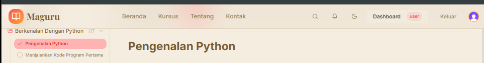

# Manual Test Checklist: Course Content Management

**Feature:** Course Content Management V2  
**Sprint:** Sprint 2 - Content First  
**Tanggal Test:** ___________  
**Tester:** ___________  
**Environment:** http://localhost:3000

---

## Persiapan

Sebelum memulai test, pastikan kondisi berikut terpenuhi:

- [x] Aplikasi berjalan di `http://localhost:3000`
- [x] Database memiliki 1 course PUBLISHED milik akun creator test
  - Course memiliki minimal 1 section dengan 2+ lessons
  - Lesson content berisi minimal 1 heading (untuk verifikasi Tiptap rendering)
  - Catat slug course: `___________`
- [x] Akun creator tersedia dan memiliki course di atas
- [x] Akun student tersedia dan sudah enrolled di course di atas
- [x] Browser DevTools siap untuk cek network/console errors

---

## 1. Creator: Manage Course Page

### 1.1 Akses Halaman dengan Auth Creator

- [x] Login sebagai creator
- [x] Buka `http://localhost:3000/creator/courses/[slug]/manage`
- [x] Halaman tampil tanpa error
- [x] Tidak ada redirect ke `/sign-in`

### 1.2 Header: Judul, Status Badge, Tombol Publish/Unpublish

- [x] Judul course tampil di header
- [x] Status badge tampil (PUBLISHED atau DRAFT)
- [x] Tombol Publish/Unpublish tampil di header kanan
- [x] Klik tombol → status berubah tanpa full reload
- [x] Loading spinner tampil di tombol saat proses toggle

### 1.3 Sidebar: Overview, Daftar Seksi, Expand/Collapse

- [x] Sidebar kiri tampil dengan item "Overview Kursus"
- [x] Daftar seksi tampil di bawah Overview
- [x] Klik seksi → expand/collapse daftar pelajaran di dalam seksi
- [x] Klik "Overview Kursus" → area kanan tampilkan info course

### 1.4 Buat Seksi Baru → Muncul di Sidebar

- [x] Klik tombol "+ Tambah Seksi" di bagian bawah sidebar
- [x] Input inline muncul langsung di sidebar (bukan dialog)
- [x] Cursor sudah aktif di input field
- [x] Ketik judul seksi (misal: "Seksi Test Manual")
- [x] Tekan Enter
- [x] Seksi baru muncul di sidebar dengan judul yang diketik
- [x] Tidak ada error di console

**Variasi — klik di luar:**
- [x] Klik "+ Tambah Seksi" lagi
- [x] Ketik judul seksi baru
- [x] Klik di luar sidebar (area konten)
- [x] Seksi tersimpan dan muncul di sidebar

**Variasi — batalkan:**
- [x] Klik "+ Tambah Seksi"
- [x] Tekan Escape (atau biarkan input kosong lalu klik di luar)
- [x] Input hilang, tidak ada seksi baru dibuat
- [x] Tidak ada error di console

### 1.5 Edit Seksi → Perubahan Tersimpan

- [x] Hover pada seksi yang ada → icon `⋯` muncul di kanan
- [x] Klik icon `⋯` → dropdown terbuka
- [x] Klik "Edit Seksi"
- [x] Judul seksi di sidebar langsung berubah menjadi input field (inline, bukan dialog)
- [x] Teks judul existing sudah ter-select di input
- [x] Ubah judul seksi (misal: tambahkan " - Updated")
- [x] Tekan Enter
- [x] Input hilang, judul seksi di sidebar berubah sesuai input baru
- [x] Tidak ada error di console

**Variasi — klik di luar:**
- [x] Klik `⋯` → Edit Seksi
- [x] Ubah judul
- [x] Klik di luar input
- [x] Judul tersimpan

**Variasi — batalkan:**
- [x] Klik `⋯` → Edit Seksi
- [x] Tekan Escape
- [x] Judul kembali ke semula, tidak ada perubahan

### 1.6 Hapus Seksi → Cascade Delete Lessons

- [x] Pastikan seksi yang akan dihapus memiliki minimal 1 lesson
- [x] Hover pada seksi → icon `⋯` muncul
- [x] Klik icon `⋯` → dropdown terbuka
- [x] Klik "Hapus Seksi" (merah)
- [x] Dialog konfirmasi muncul dengan nama seksi dan pesan warning
- [x] Tombol "Batal" dan "Ya, Hapus" tampil di dialog
- [x] Klik "Batal" → dialog tertutup, seksi tidak dihapus
- [x] Klik `⋯` → "Hapus Seksi" lagi → klik "Ya, Hapus"
- [x] Seksi hilang dari sidebar
- [x] Lesson-lesson di dalam seksi tersebut juga hilang
- [x] Tidak ada error di console

### 1.7 Tambah Pelajaran → Lesson Tersimpan

- [x] Hover pada seksi → icon `⋯` muncul
- [x] Klik icon `⋯` → dropdown terbuka
- [x] Klik "Tambah Pelajaran"
- [x] Panel editor terbuka di area konten utama (bukan dialog)
- [x] Input judul pelajaran tampil di atas dengan placeholder "Judul pelajaran..."
- [x] Area Tiptap editor tampil di bawah judul
- [x] Toolbar editor tampil di header bar
- [x] Tombol split "Create | ∨" tampil di kanan header bar
- [x] Isi judul pelajaran (misal: "Pelajaran Test Manual")
- [x] Klik di area editor dan ketik konten
- [x] Klik tombol "Create" atau tekan `Ctrl+Enter` (Windows) / `Cmd+Enter` (Mac)
- [x] Loading state "Menyimpan..." tampil di tombol
- [x] Setelah berhasil, view berpindah ke lesson viewer
- [x] Lesson baru muncul di sidebar di bawah seksi yang dipilih
- [x] Tidak ada error di console

**Variasi — shortcut keyboard:**
- [x] Isi judul dan konten lesson
- [x] Tekan `Ctrl+Enter` (Windows) atau `Cmd+Enter` (Mac)
- [x] Lesson tersimpan tanpa klik tombol, tidak ada newline yang terbuat
- [x] Lesson baru muncul di sidebar di bawah seksi yang dipilih
- [x] Tidak ada error di console

**Variasi — batalkan via dropdown:**
- [x] Klik "Tambah Pelajaran" lagi
- [x] Isi sebagian konten
- [x] Klik chevron `∨` di kanan tombol Create
- [x] Dropdown muncul dengan opsi "Cancel"
- [x] Klik "Cancel"
- [x] View kembali ke section view, lesson tidak tersimpan

### 1.8 Edit Pelajaran → Version Increment

- [x] Hover pada lesson di sidebar → ikon edit muncul
- [x] Klik ikon edit
- [x] Panel editor terbuka dengan konten existing ter-load
- [x] Tombol split "Save | ∨" tampil di kanan header bar (bukan "Create")
- [x] Ubah konten di Tiptap editor (tambah atau hapus teks)
- [x] Klik tombol "Save" atau tekan `Ctrl+Enter` (Windows) / `Cmd+Enter` (Mac)
- [x] Loading state "Menyimpan..." tampil di tombol
- [x] Setelah berhasil, view berpindah ke lesson viewer
- [x] Konten lesson sudah berubah sesuai edit

### 1.9 Hapus Pelajaran → Hilang dari Sidebar

- [x] Hover pada lesson di sidebar → icon `⋯` muncul di kanan
- [x] Klik icon `⋯` → dropdown terbuka dengan opsi "Edit" dan "Hapus"
- [x] Klik "Hapus" (merah)
- [x] Lesson hilang dari sidebar
- [x] Tidak ada error di console

### 1.10 Reorder Seksi & Pelajaran via Drag and Drop

- [x] Pastikan ada minimal 2 seksi di course
- [x] Hover pada seksi → icon ⠿ (grip) muncul di kiri item
- [x] Klik tahan icon ⠿ pada Seksi B lalu seret ke atas Seksi A
- [x] Seksi B sekarang berada di atas Seksi A di sidebar
- [x] Refresh halaman → urutan tetap tersimpan (Seksi B masih di atas)
- [x] Tidak ada error di console

**Variasi — reorder lesson:**
- [x] Expand salah satu seksi yang memiliki minimal 2 lesson
- [x] Klik tahan icon ⠿ pada Lesson B lalu seret ke atas Lesson A
- [x] Lesson B sekarang berada di atas Lesson A dalam seksi tersebut
- [x] Refresh halaman → urutan lesson tetap tersimpan
- [x] Tidak ada error di console

### 1.11 Publish/Unpublish Toggle → Status Berubah

- [x] Pastikan course dalam status DRAFT
- [x] Klik tombol "Publish"
- [x] Loading spinner tampil
- [x] Status badge berubah ke PUBLISHED
- [x] Tombol berubah menjadi "Unpublish"
- [x] Klik tombol "Unpublish"
- [x] Status badge berubah ke DRAFT
- [x] Tidak ada full page reload selama proses

### 1.12 Akses Tanpa Auth → Redirect `/sign-in`

- [x] Logout dari aplikasi
- [x] Buka `http://localhost:3000/creator/courses/[slug]/manage`
- [x] Redirect ke `/sign-in`
- [x] Tidak ada konten creator yang terekspos

---

## 2. Student: Learn Page

### 2.1 Akses Halaman dengan Auth Student Enrolled

- [x] Login sebagai student yang sudah enrolled
- [x] Buka `http://localhost:3000/course/[slug]/learn`
- [x] Halaman tampil tanpa error
- [x] Tidak ada redirect ke `/sign-in`

### 2.2 Sidebar: Daftar Seksi dan Lesson Tampil

- [x] Sidebar kiri tampil
- [x] Semua seksi course tampil di sidebar
- [x] Klik seksi → expand/collapse daftar lesson di dalam seksi
- [x] Semua lesson tampil di bawah seksi masing-masing

### 2.3 Klik Lesson → Konten Tiptap Ter-render

- [x] Klik salah satu lesson di sidebar
- [x] Area konten utama menampilkan konten lesson
- [x] Heading (h1/h2/h3) ter-render dengan ukuran font yang berbeda
- [x] Paragraph ter-render sebagai teks biasa
- [x] (Jika ada) Bold/italic ter-render dengan formatting yang benar
- [x] (Jika ada) List ter-render sebagai bullet/numbered list
- [x] (Jika ada) Code block ter-render dengan background berbeda
- [x] Tidak ada raw JSON yang terlihat di halaman

### 2.4 Progress Bar Tampil dengan Persentase

- [x] Progress bar tampil di bagian atas halaman
- [x] Persentase tampil (misal: "30%")
- [x] Jumlah lesson selesai / total lesson tampil (misal: "3 / 10 pelajaran selesai")
- [x] Nilai persentase sesuai dengan jumlah lesson yang sudah diselesaikan

### 2.5 Tandai Selesai → Checkmark Muncul di Sidebar

- [x] Buka lesson yang belum diselesaikan
- [x] Klik tombol navigasi `>` (Next) untuk pindah ke lesson berikutnya
- [x] Lesson sebelumnya otomatis ditandai selesai
- [x] Checkmark (✓) muncul di sidebar di sebelah lesson yang baru saja ditinggalkan
- [x] Tidak ada error di console

### 2.6 Progress Bar Update Setelah Mark Complete

- [ ] Catat persentase progress sebelum mark complete
- [x] Klik tombol navigasi `>` (Next) untuk pindah ke lesson berikutnya
- [x] Progress bar update otomatis (tanpa refresh)
- [x] Persentase naik sesuai perhitungan (misal: dari 30% ke 40% jika ada 10 lessons)
- [x] Jumlah "X / Y pelajaran selesai" juga bertambah

### 2.7 Tombol Berikutnya → Lesson Berikutnya Ter-load

- [x] Buka lesson yang bukan lesson terakhir
- [x] Tombol "Pelajaran Berikutnya" tampil
- [x] Klik tombol
- [x] Konten lesson berikutnya ter-load di area utama
- [x] Judul lesson di area utama berubah sesuai lesson berikutnya
- [x] Lesson berikutnya ter-highlight di sidebar

### 2.8 Tombol Sebelumnya → Lesson Sebelumnya Ter-load

- [x] Buka lesson yang bukan lesson pertama
- [x] Tombol "<" untuk Pelajaran Sebelumnya tampil
- [x] Klik tombol
- [x] Konten lesson sebelumnya ter-load di area utama
- [x] Judul lesson di area utama berubah sesuai lesson sebelumnya

### 2.9 Prev Disabled di Lesson Pertama, Next Disabled di Terakhir

- [x] Navigasi ke lesson pertama di course
- [x] Tombol "Pelajaran Sebelumnya" disabled atau tidak tampil
- [x] Navigasi ke lesson terakhir di course
- [x] Tombol "Pelajaran Berikutnya" disabled atau tidak tampil

### 2.10 Refresh Halaman → Progress Tetap Tersimpan

- [x] Tandai beberapa lesson sebagai selesai
- [x] Catat lesson mana saja yang sudah selesai dan persentase progress
- [x] Refresh halaman (F5 atau Ctrl+R)
- [x] Checkmark tetap muncul di sidebar untuk lesson yang sudah selesai
- [x] Progress bar menampilkan persentase yang sama seperti sebelum refresh
- [x] Tidak ada progress yang hilang

### 2.11 Error State: Lesson Tidak Ditemukan → Pesan Error Tampil

- [x] Buka URL dengan lesson ID yang tidak valid:
  `http://localhost:3000/course/[slug]/learn?lessonId=invalid-id-xyz`
- [x] Pesan error tampil di area konten utama (bukan blank page)
- [x] Pesan error informatif (misal: "Pelajaran tidak ditemukan")
- [x] Tombol retry atau kembali tersedia
- [x] Tidak ada crash atau white screen

### 2.12 Akses Tanpa Auth → Redirect `/sign-in`

- [x] Logout dari aplikasi
- [x] Buka `http://localhost:3000/course/[slug]/learn`
- [x] Redirect ke `/sign-in`
- [x] Tidak ada konten lesson yang terekspos

---

## Catatan Test

| No | Item | Temuan | Severity | Status |
|----|------|--------|----------|--------|
| 1  |      |        |          |        |
| 2  |      |        |          |        |
| 3  |      |        |          |        |
| 4  |      |        |          |        |
| 5  |      |        |          |        |

**Severity Legend:**
- 🔴 Critical — fitur tidak bisa digunakan sama sekali
- 🟠 High — fitur bisa digunakan tapi ada bug signifikan
- 🟡 Medium — bug ada tapi ada workaround
- 🟢 Low — kosmetik atau minor issue

**Hasil Keseluruhan:** ⬜ Pass / ⬜ Partial / ⬜ Fail

**Catatan tambahan:**
_Isi di sini jika ada temuan yang perlu didiskusikan lebih lanjut._
