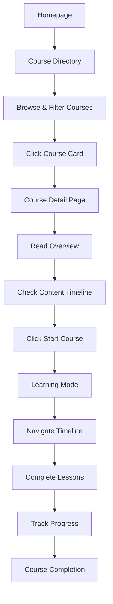

#  User Flow - Course Feature

## Ringkasan User Journey


##  1. Course Directory Flow (`/course`)

### **Tujuan**: Menemukan dan menjelajahi kursus yang tersedia

### **User Actions**:
-  **Browse Courses**: Melihat daftar semua kursus yang tersedia
- **Search**: Mencari kursus berdasarkan judul atau deskripsi
-  **Filter**: Menyaring kursus berdasarkan:
  - **Kategori**: Development, Business, Design, Marketing
  - **Level**: Beginner, Intermediate, Advanced
  - **Durasi**: <2 jam, 2-5 jam, 5-10 jam, >10 jam
  - **Harga**: Gratis, Berbayar
-  **Responsive**: Mobile-friendly dengan grid layout

### **Navigation Path**:
```
Homepage ->  Course Directory -> Filter/Search -> Course Card Click -> Course Detail
```

### **Key Components**:
- `CourseFilters`: Panel filter dengan search functionality
- `CourseCard`: Individual course card dengan progress indicator
- `CourseGrid`: Responsive grid layout (mobile: 1 kolom, desktop: 3 kolom)

---

##  2. Course Detail Flow (`/course/[slug]`)

### **Tujuan**: Mengevaluasi kursus sebelum memulai pembelajaran

### **User Actions**:
-  **Review Course**: Melihat informasi lengkap kursus
-  **Tab Navigation**:
  - **Overview**: Deskripsi lengkap dan objektif pembelajaran
  - **Content**: Preview materi dan timeline kursus
  - **Instructor**: Informasi instructor (future feature)
-  **Start Learning**: Memulai atau melanjutkan kursus
-  **Back**: Kembali ke course directory

### **Navigation Path**:
```
Course Directory -> Course Detail -> Tab Exploration -> Start Course -> Learning Mode
```

### **Key Components**:
- `CourseHeader`: Informasi utama kursus dengan tombol action
- `CourseTabs`: Tab interface untuk navigasi konten
- `OverviewRenderer`: Render konten markdown untuk deskripsi
- `TimelinePreview`: Preview timeline dan materi kursus

### **Progress Tracking**:
-  Menampilkan progress untuk kursus yang sudah dimulai
-  Progress percentage dan completion status
-  Last accessed material tracking

---

##  3. Learning Mode Flow (`/course/[slug]/learn`)

### **Tujuan**: Melakukan pembelajaran interaktif dengan progress tracking

### **User Actions**:
-  **Content Navigation**: Berpindah antar lesson/chapter
-  **Mark Complete**: Menandai lesson sebagai selesai
-  **Navigate**: Previous/Next navigation antar materi
-  **Track Progress**: Monitoring progress real-time
-  **Mobile Learning**: Responsive layout untuk mobile learning

### **Navigation Path**:
```
Course Detail -> Learning Mode -> Content Navigation -> Complete Lessons -> Course Completion
```

### **Key Components**:
- `TimelineNav`: Navigasi timeline untuk akses cepat materi
- `ContentRenderer`: Render konten (markdown, video, quiz)
- `useCourse`: Hook untuk state management dan progress tracking

### **Layout Strategy**:
- **Desktop**: 4-column grid (1 kolom timeline, 3 kolom konten)
- **Mobile**: Single column dengan bottom sheet timeline

---

##  Complete User Journey

### **Happy Path Flow**:


### **Alternative Paths**:
- **Direct Access**: User langsung ke learning mode jika sudah memiliki progress
- **Multi-Device**: Sync progress antar desktop dan mobile
- **Resume Learning**: User dapat melanjutkan dari titik terakhir


---

*Last Updated: November 2024*
*Version: 1.0*
*Status: Active Development*